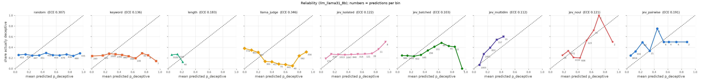
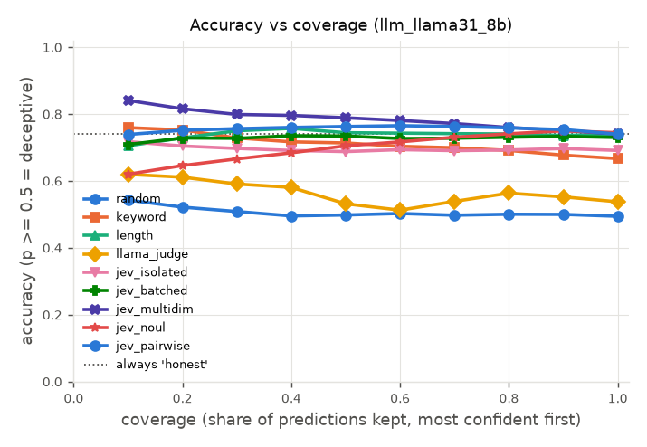
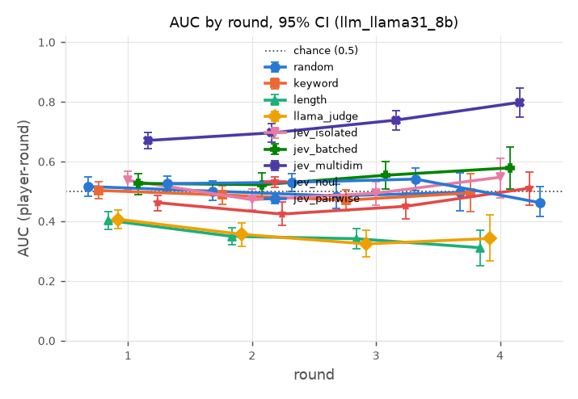

# Judge report: core

## Wave 4 addendum (merge, 2026-09-27)

This report now includes the three richer Jev judges from Wave 4 H (details in [richer_jev.md](richer_jev.md)). The Wave 3 interpretation below is unchanged and covers the first six judges.

- **jev_multidim** (5 Score dimensions per player, combined by a composite fixed before seeing labels) gets **AUC 0.706 [0.680, 0.730]**, the best judge here by a wide margin; jev_batched gets 0.542. richer_jev.md traces the gain to llama-8B's wolf style: wolves are less specific and accuse less. It does **not** carry over to human games (human.md: 0.444-0.524 per source) or to GPT-4o games (llm_mafia 0.532). Read it as "Jev's dimensions capture this generator's wolf style", not as general lie detection.
- **jev_noul** ("Is X concealing their true role?") gets 0.449 [0.416, 0.482], below chance on these games.
- **jev_pairwise** (who protects whom) gets 0.545 [0.525, 0.566], no different from jev_batched (paired -0.003 [-0.046, +0.039]).
- The ablations (criteria leak, defense) are in [ablations.md](ablations.md). The live-game and stress results on other sources are in [live.md](live.md) and [stress.md](stress.md). The frontier (Claude) judge has not been run, because there is no API key.

## Interpretation (Wave 3 F)

**Data.** 200 generated games (`llm_llama31_8b`): 9 players, 2 wolves, llama3.1:8b plays every player with generic personas, and votes are random. That gives 699 judged views and 4,479 player-rounds. All six judges scored every view. Numbers are from the tables below. CIs are 95% bootstrap intervals that resample whole games, and "beats" means a paired bootstrap on the same games whose CI excludes 0.

**1. Only jev_batched is above chance, and only just.**
- **Headline AUC:** jev_batched 0.542 [0.504, 0.574]; its CI excludes 0.5, barely.
- **Against baselines (paired AUC tests):**
  - jev_batched beats keyword (+0.054 [+0.011, +0.095]).
  - It does **not** conclusively beat random (+0.039 [−0.002, +0.079], p = 0.058) or the talk-volume baseline `length` (+0.039 [−0.003, +0.077], p = 0.072).
  - It beats jev_isolated (+0.029 [+0.001, +0.055], p = 0.046). That is borderline: with ~30 comparisons in this table, one p ≈ 0.05 is expected by chance alone.
- **jev_isolated, keyword and length are indistinguishable from chance:**
  - jev_isolated AUC 0.513 [0.483, 0.541].
  - keyword 0.488 [0.462, 0.513].
  - length 0.503 [0.492, 0.514].
- **Round-1 top-1:** no judge is conclusively above chance (0.222). The best is jev_batched at +0.058 [−0.007, +0.115]. The only conclusive differences are against `length`, which is *below* chance here (−0.062 [−0.107, −0.007]); jev_batched, jev_isolated, llama and random all beat it. So in round 1 wolves talk a little less than villagers, and "top-1 beats length" is no evidence of skill.
- **By round:** jev_batched's per-round AUC edges up from 0.527 (round 1) to 0.578 [0.507, 0.649] (round 4, 108 games). The per-round CIs overlap.

**2. llama_judge is conclusively *worse* than chance: it ranks wolves as less suspicious.**
- **Numbers:** AUC 0.403 [0.370, 0.437], below 0.5 in every round (0.324 to 0.406). Random, keyword, length and both Jev judges all beat it on AUC in the paired tests.
- **Where it comes from:** its mean p is 0.29 for wolves vs 0.38 for villagers, with 0 parse failures in 699 views. So this is a real, inverted signal, not a parsing artifact.
- **Possible cause (not tested):** the same model wrote the wolves' lines and judges them. It may be following the table's accusations, which the coordinated wolves steer onto villagers.
- **Contrast with other data ([human.md](human.md)):** llama was never below chance there. It sat at chance on human_mafia (0.496) and werewolf_among_us (0.491), and was slightly above it on llm_mafia (0.552 [0.513, 0.595]).

**3. Calibration: the Jev judges are clearly best, but no judge is useful as a yes/no classifier.**
- **ECE:** jev_batched 0.103 [0.084, 0.124] and jev_isolated 0.122 [0.106, 0.141]. Both beat random, length and llama in the paired tests; jev_batched also beats keyword. jev_batched vs jev_isolated is inconclusive.
- **Classifier accuracy:** with 2 wolves in 9, always answering "honest" is right 74.0% of the time. jev_batched's accuracy at p ≥ 0.5 is 73.0% [71.8, 74.1], no better than that baseline.
- **Bottom line:** Jev is well calibrated mostly because it keeps its p near the base rate, not because it separates the teams.

**4. Cost and latency (699 views).**
| Judge | Total cost | Per game | Mean time per view |
|---|---|---|---|
| jev_batched | $0.069 | $0.0003 | 0.20 s |
| jev_isolated | $0.092 | $0.0005 | 0.39 s |
| llama_judge | free (local GPU) | free | 5.25 s |
| random, keyword, length | $0 | $0 | ~0 s |

**5. What's inconclusive, and how many more games would settle it.** These are rough power calculations, assuming the CI half-width shrinks as 1/√n and the effect stays the same.
- **jev_batched vs random, and vs length (AUC):** the observed gap is ~0.04 and the paired CI half-width is ~0.04 at 200 games. 80% power at α = 0.05 needs a half-width of ~0.027, so **~450 games in total, i.e. ~250 more.** At ~30 s per game that is ~2 GPU-hours of generation and ~$0.1 of Jev per Jev judge.
- **jev_batched round-1 top-1 vs chance:** +0.058 ± 0.061 now, which also needs **~450 games**.
- **jev_isolated vs random:** the gap is +0.010. At that size it would take **~5,000 games**, so in practice jev_isolated has no useful signal on these games.
- **jev_batched vs jev_isolated (AUC):** already at p = 0.046. About **~400 games** would make it robust.

**6. Comparison with the human data ([human.md](human.md), Wave 3 E; same judge keys).**
- **Where Jev detects deception:**
  - **llm_mafia** (GPT-4o agents): jev_batched AUC 0.640, jev_isolated 0.609. Both beat every baseline there.
  - **Our llama-8B games:** a weak signal at best (jev_batched 0.542; jev_isolated at chance).
  - **Human games:** chance on all three sources (human_mafia, avalon, werewolf_among_us).
- **So the LLM-text signal isn't uniform.** These games are shorter, with fewer and blander messages from an 8B model under generic personas (no "deflect blame" criterion). They give Jev much less to work with than GPT-4o's long Mafia chats.
- **Stable across all datasets:** jev_batched ≥ jev_isolated on AUC, and Jev is cheap (~$0.0003 to $0.0005 per game here) and fast (0.2 to 0.4 s per view). On LLM text it is also reasonably calibrated.
- **Not yet shown:** on the generated games, Jev beats random or talk volume at a confidence level we'd accept. That needs the extra ~250 games above.

---

Generated 2026-09-27 12:50 by `python -m ww.eval.report --sources llm_llama31_8b --judges random-f760e1b3a694,keyword-e6b64872a12e,length-daf73ce8d4a6,llama_judge-c990a3c24747,jev_isolated-8b754593c8ab,jev_batched-0650211bf044,jev_multidim-48946ed5491a,jev_noul-e99507152316,jev_pairwise-7be3255d4c01 --out reports/core.md`.
Data: `B:\jev-blackjack\data`. Every number below is computed from the transcript and judgment files listed here.
CIs: 95% percentile bootstrap resampling whole games (1000 replicates, seed 0). Where two judges' CIs overlap, the table alone does not show a difference; use the paired comparisons.

Unit of analysis: *player-round* = one judge score for one player who spoke in that round's view (views include all earlier rounds). *Per statement* weights each score by how many statements the player made that round.

## Judges and data

| Judge | Judge key | Config |
|---|---|---|
| random | `random-f760e1b3a694` | seed=0, version=1 |
| keyword | `keyword-e6b64872a12e` | cues={'hedge': ['maybe', 'perhaps', 'possibly', 'probably', 'm..., scale=10.0, version=1, weights={'hedge': 1.0, 'accusation': 1.0, 'defensive': 1.5} |
| length | `length-daf73ce8d4a6` | scale=5000.0, version=1 |
| llama_judge | `llama_judge-c990a3c24747` | include_defense=True, json_mode=True, max_retries=1, model=llama3.1:8b, prompt_sha=764b9cfffb06, seed=0, temperature=0.0, version=1, view_window={'version': 1, 'max_state_chars': 90000} |
| jev_isolated | `jev_isolated-8b754593c8ab` | criteria=['consistent, specific, and forthcoming', 'somewhat vague..., criteria_variant=generic, include_defense=True, model=jev-1.13.0, version=1 |
| jev_batched | `jev_batched-0650211bf044` | criteria=['consistent, specific, and forthcoming', 'somewhat vague..., criteria_variant=generic, include_defense=True, model=jev-1.13.0, version=1, view_window={'version': 1, 'max_state_chars': 90000} |
| jev_multidim | `jev_multidim-48946ed5491a` | dimensions={'evasiveness': {'instructions': 'This is the public reco..., include_defense=True, model=jev-1.13.0, version=1, view_window={'version': 1, 'max_state_chars': 90000} |
| jev_noul | `jev_noul-e99507152316` | include_defense=True, model=jev-1.13.0, question={'instructions': 'This is the public record of a social d..., version=1, view_window={'version': 1, 'max_state_chars': 90000} |
| jev_pairwise | `jev_pairwise-7be3255d4c01` | include_defense=True, model=jev-1.13.0, question={'instructions': 'This is the public record of a social d..., version=1, view_window={'version': 1, 'max_state_chars': 90000} |

| Judge | Source | Games judged | Complete | Transcripts |
|---|---|---|---|---|
| random | llm_llama31_8b | 200 | 200 | 200 |
| keyword | llm_llama31_8b | 200 | 200 | 200 |
| length | llm_llama31_8b | 200 | 200 | 200 |
| llama_judge | llm_llama31_8b | 200 | 200 | 200 |
| jev_isolated | llm_llama31_8b | 200 | 200 | 200 |
| jev_batched | llm_llama31_8b | 200 | 200 | 200 |
| jev_multidim | llm_llama31_8b | 200 | 200 | 200 |
| jev_noul | llm_llama31_8b | 200 | 200 | 200 |
| jev_pairwise | llm_llama31_8b | 200 | 200 | 200 |

## Source: `llm_llama31_8b`

### Accuracy and calibration

| Judge | Games | AUC player-round | AUC per statement | Round-1 top-1 | R1 chance | Top-1 minus chance | ECE | Brier | Acc @ 50% coverage | Acc @ 100% | Confidence used |
|---|---|---|---|---|---|---|---|---|---|---|---|
| random | 200 | 0.502 [0.482, 0.521] | 0.502 [0.482, 0.521] | 0.270 [0.210, 0.335] | 0.222 [0.222, 0.222] | 0.048 [-0.012, 0.113] | 0.307 [0.296, 0.320] | 0.333 [0.326, 0.342] | 0.498 [0.478, 0.518] | 0.494 [0.481, 0.506] | abs(p-0.5) |
| keyword | 200 | 0.488 [0.462, 0.513] | 0.488 [0.462, 0.513] | 0.195 [0.147, 0.253] | 0.222 [0.222, 0.222] | -0.027 [-0.075, 0.030] | 0.136 [0.120, 0.153] | 0.224 [0.219, 0.230] | 0.713 [0.692, 0.732] | 0.666 [0.654, 0.681] | abs(p-0.5) |
| length | 200 | 0.503 [0.492, 0.514] | 0.503 [0.492, 0.514] | 0.160 [0.115, 0.215] | 0.222 [0.222, 0.222] | -0.062 [-0.107, -0.007] | 0.183 [0.178, 0.188] | 0.228 [0.224, 0.231] | 0.744 [0.738, 0.751] | 0.740 [0.735, 0.745] | abs(p-0.5) |
| llama_judge | 200 | 0.403 [0.370, 0.437] | 0.403 [0.370, 0.437] | 0.273 [0.210, 0.333] | 0.222 [0.222, 0.222] | 0.050 [-0.012, 0.110] | 0.346 [0.323, 0.367] | 0.330 [0.313, 0.346] | 0.531 [0.497, 0.566] | 0.537 [0.515, 0.560] | abs(p-0.5) |
| jev_isolated | 200 | 0.513 [0.483, 0.541] | 0.513 [0.483, 0.541] | 0.260 [0.203, 0.320] | 0.222 [0.222, 0.222] | 0.038 [-0.020, 0.098] | 0.122 [0.106, 0.141] | 0.216 [0.209, 0.222] | 0.687 [0.670, 0.705] | 0.691 [0.678, 0.703] | judge |
| jev_batched | 200 | 0.542 [0.504, 0.574] | 0.542 [0.504, 0.574] | 0.280 [0.215, 0.338] | 0.222 [0.222, 0.222] | 0.058 [-0.007, 0.115] | 0.103 [0.084, 0.124] | 0.206 [0.198, 0.215] | 0.734 [0.712, 0.753] | 0.730 [0.718, 0.741] | judge |
| jev_multidim | 200 | 0.706 [0.680, 0.730] | 0.706 [0.680, 0.730] | 0.300 [0.240, 0.365] | 0.222 [0.222, 0.222] | 0.078 [0.018, 0.143] | 0.112 [0.103, 0.121] | 0.190 [0.186, 0.195] | 0.789 [0.771, 0.804] | 0.740 [0.735, 0.745] | judge |
| jev_noul | 200 | 0.449 [0.416, 0.482] | 0.449 [0.416, 0.482] | 0.246 [0.188, 0.307] | 0.222 [0.222, 0.222] | 0.024 [-0.034, 0.084] | 0.121 [0.107, 0.139] | 0.204 [0.200, 0.208] | 0.705 [0.685, 0.724] | 0.744 [0.735, 0.753] | abs(p-0.5) |
| jev_pairwise | 200 | 0.545 [0.525, 0.566] | 0.545 [0.525, 0.566] | 0.246 [0.212, 0.285] | 0.222 [0.222, 0.222] | 0.024 [-0.010, 0.062] | 0.191 [0.186, 0.197] | 0.227 [0.223, 0.232] | 0.762 [0.750, 0.776] | 0.740 [0.735, 0.745] | abs(p-0.5) |

- Ranked by AUC (player-round): jev_multidim > jev_pairwise > jev_batched > jev_isolated > length > random > keyword > jev_noul > llama_judge
- Ranked by round-1 top-1: jev_multidim > jev_batched > llama_judge > random > jev_isolated > jev_pairwise = jev_noul > keyword > length
- Ranked by ECE (lower is better): jev_batched < jev_multidim < jev_noul < jev_isolated < keyword < length < jev_pairwise < random < llama_judge
- Rankings order point estimates only; see the paired comparisons below for which gaps are real.
- Chance: AUC 0.5; round-1 top-1 = mean over games of n_deceptive / n_scored_players (column R1 chance). Always answering 'honest' scores accuracy 0.740 on these rows.

### Cost and latency (per judge.score call = one round's view)

| Judge | Calls | Mean latency s | Median s | p95 s | Total cost | Cost per game |
|---|---|---|---|---|---|---|
| random | 699 | 0.00 [0.00, 0.00] | 0.00 | 0.00 | $0.0000 | $0.0000 [$0.0000, $0.0000] |
| keyword | 699 | 0.00 [0.00, 0.00] | 0.00 | 0.00 | $0.0000 | $0.0000 [$0.0000, $0.0000] |
| length | 699 | 0.00 [0.00, 0.00] | 0.00 | 0.00 | $0.0000 | $0.0000 [$0.0000, $0.0000] |
| llama_judge | 699 | 5.25 [5.21, 5.32] | 5.64 | 7.10 | $0.0000 | $0.0000 [$0.0000, $0.0000] |
| jev_isolated | 699 | 0.39 [0.39, 0.40] | 0.38 | 0.56 | $0.0920 | $0.0005 [$0.0005, $0.0005] |
| jev_batched | 699 | 0.20 [0.19, 0.20] | 0.19 | 0.24 | $0.0691 | $0.0003 [$0.0003, $0.0004] |
| jev_multidim | 699 | 0.23 [0.22, 0.23] | 0.22 | 0.30 | $0.1554 | $0.0008 [$0.0008, $0.0008] |
| jev_noul | 699 | 0.19 [0.19, 0.20] | 0.18 | 0.24 | $0.0651 | $0.0003 [$0.0003, $0.0003] |
| jev_pairwise | 699 | 0.22 [0.22, 0.23] | 0.21 | 0.30 | $0.1766 | $0.0009 [$0.0009, $0.0009] |

n/a cost = the judge did not report `meta.cost_usd`.

### AUC by round

| Round | random | keyword | length | llama_judge | jev_isolated | jev_batched | jev_multidim | jev_noul | jev_pairwise |
|---|---|---|---|---|---|---|---|---|---|
| 1 | 0.516 [0.483, 0.549] (n=200) | 0.503 [0.474, 0.531] (n=200) | 0.402 [0.373, 0.433] (n=200) | 0.406 [0.376, 0.438] (n=200) | 0.537 [0.504, 0.567] (n=200) | 0.527 [0.490, 0.559] (n=200) | 0.670 [0.642, 0.696] (n=200) | 0.462 [0.434, 0.486] (n=200) | 0.525 [0.502, 0.552] (n=200) |
| 2 | 0.500 [0.469, 0.535] (n=200) | 0.488 [0.456, 0.518] (n=200) | 0.349 [0.321, 0.379] (n=200) | 0.356 [0.315, 0.393] (n=200) | 0.472 [0.437, 0.507] (n=200) | 0.522 [0.479, 0.561] (n=200) | 0.696 [0.664, 0.726] (n=200) | 0.424 [0.385, 0.464] (n=200) | 0.530 [0.500, 0.559] (n=200) |
| 3 | 0.484 [0.444, 0.524] (n=191) | 0.470 [0.435, 0.506] (n=191) | 0.341 [0.308, 0.375] (n=191) | 0.324 [0.281, 0.369] (n=191) | 0.493 [0.453, 0.532] (n=191) | 0.554 [0.507, 0.598] (n=191) | 0.738 [0.704, 0.770] (n=191) | 0.450 [0.408, 0.493] (n=191) | 0.541 [0.503, 0.577] (n=191) |
| 4 | 0.496 [0.433, 0.561] (n=108) | 0.494 [0.432, 0.559] (n=108) | 0.311 [0.250, 0.370] (n=108) | 0.342 [0.268, 0.422] (n=108) | 0.547 [0.478, 0.611] (n=108) | 0.578 [0.507, 0.649] (n=108) | 0.798 [0.748, 0.846] (n=108) | 0.510 [0.453, 0.565] (n=108) | 0.462 [0.416, 0.515] (n=108) |

n = games with that round judged. The plot shows rounds with at least 5 games.

### Paired comparisons (X minus Y, same games)

| X | Y | Metric | X - Y | 95% CI | p | Games | Verdict |
|---|---|---|---|---|---|---|---|
| random | keyword | AUC (player-round) | +0.015 | [-0.014, +0.045] | 0.350 | 200 | inconclusive (CI includes 0) |
| random | keyword | Round-1 top-1 | +0.075 | [-0.005, +0.155] | 0.066 | 200 | inconclusive (CI includes 0) |
| random | keyword | ECE | +0.171 | [+0.152, +0.191] | <0.002 | 200 | keyword better |
| random | length | AUC (player-round) | -0.000 | [-0.024, +0.021] | 0.958 | 200 | inconclusive (CI includes 0) |
| random | length | Round-1 top-1 | +0.110 | [+0.030, +0.195] | 0.010 | 200 | random better |
| random | length | ECE | +0.123 | [+0.110, +0.140] | <0.002 | 200 | length better |
| random | llama_judge | AUC (player-round) | +0.100 | [+0.061, +0.136] | <0.002 | 200 | random better |
| random | llama_judge | Round-1 top-1 | -0.003 | [-0.090, +0.085] | 1.000 | 200 | inconclusive (CI includes 0) |
| random | llama_judge | ECE | -0.039 | [-0.064, -0.011] | 0.002 | 200 | random better |
| random | jev_isolated | AUC (player-round) | -0.010 | [-0.045, +0.025] | 0.596 | 200 | inconclusive (CI includes 0) |
| random | jev_isolated | Round-1 top-1 | +0.010 | [-0.075, +0.095] | 0.826 | 200 | inconclusive (CI includes 0) |
| random | jev_isolated | ECE | +0.185 | [+0.164, +0.206] | <0.002 | 200 | jev_isolated better |
| random | jev_batched | AUC (player-round) | -0.039 | [-0.079, +0.002] | 0.058 | 200 | inconclusive (CI includes 0) |
| random | jev_batched | Round-1 top-1 | -0.010 | [-0.092, +0.078] | 0.878 | 200 | inconclusive (CI includes 0) |
| random | jev_batched | ECE | +0.204 | [+0.180, +0.228] | <0.002 | 200 | jev_batched better |
| random | jev_multidim | AUC (player-round) | -0.204 | [-0.236, -0.170] | <0.002 | 200 | jev_multidim better |
| random | jev_multidim | Round-1 top-1 | -0.030 | [-0.120, +0.055] | 0.566 | 200 | inconclusive (CI includes 0) |
| random | jev_multidim | ECE | +0.195 | [+0.180, +0.213] | <0.002 | 200 | jev_multidim better |
| random | jev_noul | AUC (player-round) | +0.054 | [+0.017, +0.091] | 0.008 | 200 | random better |
| random | jev_noul | Round-1 top-1 | +0.024 | [-0.061, +0.103] | 0.542 | 200 | inconclusive (CI includes 0) |
| random | jev_noul | ECE | +0.186 | [+0.166, +0.206] | <0.002 | 200 | jev_noul better |
| random | jev_pairwise | AUC (player-round) | -0.042 | [-0.072, -0.014] | 0.002 | 200 | jev_pairwise better |
| random | jev_pairwise | Round-1 top-1 | +0.024 | [-0.049, +0.099] | 0.500 | 200 | inconclusive (CI includes 0) |
| random | jev_pairwise | ECE | +0.116 | [+0.102, +0.132] | <0.002 | 200 | jev_pairwise better |
| keyword | length | AUC (player-round) | -0.015 | [-0.046, +0.014] | 0.342 | 200 | inconclusive (CI includes 0) |
| keyword | length | Round-1 top-1 | +0.035 | [-0.038, +0.110] | 0.392 | 200 | inconclusive (CI includes 0) |
| keyword | length | ECE | -0.047 | [-0.065, -0.029] | <0.002 | 200 | keyword better |
| keyword | llama_judge | AUC (player-round) | +0.085 | [+0.047, +0.121] | <0.002 | 200 | keyword better |
| keyword | llama_judge | Round-1 top-1 | -0.078 | [-0.158, +0.010] | 0.086 | 200 | inconclusive (CI includes 0) |
| keyword | llama_judge | ECE | -0.210 | [-0.234, -0.184] | <0.002 | 200 | keyword better |
| keyword | jev_isolated | AUC (player-round) | -0.025 | [-0.060, +0.011] | 0.164 | 200 | inconclusive (CI includes 0) |
| keyword | jev_isolated | Round-1 top-1 | -0.065 | [-0.138, +0.015] | 0.118 | 200 | inconclusive (CI includes 0) |
| keyword | jev_isolated | ECE | +0.014 | [-0.009, +0.034] | 0.224 | 200 | inconclusive (CI includes 0) |
| keyword | jev_batched | AUC (player-round) | -0.054 | [-0.095, -0.011] | 0.006 | 200 | jev_batched better |
| keyword | jev_batched | Round-1 top-1 | -0.085 | [-0.158, +0.003] | 0.058 | 200 | inconclusive (CI includes 0) |
| keyword | jev_batched | ECE | +0.033 | [+0.006, +0.058] | 0.010 | 200 | jev_batched better |
| keyword | jev_multidim | AUC (player-round) | -0.219 | [-0.252, -0.183] | <0.002 | 200 | jev_multidim better |
| keyword | jev_multidim | Round-1 top-1 | -0.105 | [-0.190, -0.020] | 0.012 | 200 | jev_multidim better |
| keyword | jev_multidim | ECE | +0.024 | [+0.004, +0.043] | 0.012 | 200 | jev_multidim better |
| keyword | jev_noul | AUC (player-round) | +0.039 | [+0.002, +0.079] | 0.038 | 200 | keyword better |
| keyword | jev_noul | Round-1 top-1 | -0.051 | [-0.123, +0.030] | 0.224 | 200 | inconclusive (CI includes 0) |
| keyword | jev_noul | ECE | +0.015 | [-0.010, +0.037] | 0.234 | 200 | inconclusive (CI includes 0) |
| keyword | jev_pairwise | AUC (player-round) | -0.057 | [-0.091, -0.020] | 0.002 | 200 | jev_pairwise better |
| keyword | jev_pairwise | Round-1 top-1 | -0.051 | [-0.119, +0.022] | 0.176 | 200 | inconclusive (CI includes 0) |
| keyword | jev_pairwise | ECE | -0.055 | [-0.073, -0.037] | <0.002 | 200 | keyword better |
| length | llama_judge | AUC (player-round) | +0.100 | [+0.062, +0.138] | <0.002 | 200 | length better |
| length | llama_judge | Round-1 top-1 | -0.113 | [-0.190, -0.035] | 0.008 | 200 | llama_judge better |
| length | llama_judge | ECE | -0.163 | [-0.185, -0.141] | <0.002 | 200 | length better |
| length | jev_isolated | AUC (player-round) | -0.010 | [-0.043, +0.023] | 0.572 | 200 | inconclusive (CI includes 0) |
| length | jev_isolated | Round-1 top-1 | -0.100 | [-0.180, -0.017] | 0.020 | 200 | jev_isolated better |
| length | jev_isolated | ECE | +0.062 | [+0.042, +0.078] | <0.002 | 200 | jev_isolated better |
| length | jev_batched | AUC (player-round) | -0.039 | [-0.077, +0.003] | 0.072 | 200 | inconclusive (CI includes 0) |
| length | jev_batched | Round-1 top-1 | -0.120 | [-0.195, -0.038] | 0.008 | 200 | jev_batched better |
| length | jev_batched | ECE | +0.081 | [+0.057, +0.099] | <0.002 | 200 | jev_batched better |
| length | jev_multidim | AUC (player-round) | -0.204 | [-0.232, -0.175] | <0.002 | 200 | jev_multidim better |
| length | jev_multidim | Round-1 top-1 | -0.140 | [-0.220, -0.060] | <0.002 | 200 | jev_multidim better |
| length | jev_multidim | ECE | +0.072 | [+0.064, +0.079] | <0.002 | 200 | jev_multidim better |
| length | jev_noul | AUC (player-round) | +0.054 | [+0.017, +0.090] | 0.002 | 200 | length better |
| length | jev_noul | Round-1 top-1 | -0.086 | [-0.162, -0.007] | 0.034 | 200 | jev_noul better |
| length | jev_noul | ECE | +0.063 | [+0.044, +0.076] | <0.002 | 200 | jev_noul better |
| length | jev_pairwise | AUC (player-round) | -0.042 | [-0.063, -0.021] | <0.002 | 200 | jev_pairwise better |
| length | jev_pairwise | Round-1 top-1 | -0.086 | [-0.151, -0.015] | 0.018 | 200 | jev_pairwise better |
| length | jev_pairwise | ECE | -0.008 | [-0.012, -0.005] | <0.002 | 200 | length better |
| llama_judge | jev_isolated | AUC (player-round) | -0.110 | [-0.144, -0.075] | <0.002 | 200 | jev_isolated better |
| llama_judge | jev_isolated | Round-1 top-1 | +0.013 | [-0.072, +0.093] | 0.774 | 200 | inconclusive (CI includes 0) |
| llama_judge | jev_isolated | ECE | +0.224 | [+0.201, +0.246] | <0.002 | 200 | jev_isolated better |
| llama_judge | jev_batched | AUC (player-round) | -0.139 | [-0.163, -0.113] | <0.002 | 200 | jev_batched better |
| llama_judge | jev_batched | Round-1 top-1 | -0.008 | [-0.070, +0.053] | 0.818 | 200 | inconclusive (CI includes 0) |
| llama_judge | jev_batched | ECE | +0.244 | [+0.224, +0.260] | <0.002 | 200 | jev_batched better |
| llama_judge | jev_multidim | AUC (player-round) | -0.304 | [-0.334, -0.275] | <0.002 | 200 | jev_multidim better |
| llama_judge | jev_multidim | Round-1 top-1 | -0.027 | [-0.095, +0.033] | 0.406 | 200 | inconclusive (CI includes 0) |
| llama_judge | jev_multidim | ECE | +0.235 | [+0.209, +0.259] | <0.002 | 200 | jev_multidim better |
| llama_judge | jev_noul | AUC (player-round) | -0.046 | [-0.065, -0.026] | <0.002 | 200 | jev_noul better |
| llama_judge | jev_noul | Round-1 top-1 | +0.027 | [-0.032, +0.082] | 0.370 | 200 | inconclusive (CI includes 0) |
| llama_judge | jev_noul | ECE | +0.226 | [+0.204, +0.243] | <0.002 | 200 | jev_noul better |
| llama_judge | jev_pairwise | AUC (player-round) | -0.142 | [-0.184, -0.100] | <0.002 | 200 | jev_pairwise better |
| llama_judge | jev_pairwise | Round-1 top-1 | +0.027 | [-0.052, +0.098] | 0.506 | 200 | inconclusive (CI includes 0) |
| llama_judge | jev_pairwise | ECE | +0.155 | [+0.132, +0.176] | <0.002 | 200 | jev_pairwise better |
| jev_isolated | jev_batched | AUC (player-round) | -0.029 | [-0.055, -0.001] | 0.046 | 200 | jev_batched better |
| jev_isolated | jev_batched | Round-1 top-1 | -0.020 | [-0.087, +0.045] | 0.606 | 200 | inconclusive (CI includes 0) |
| jev_isolated | jev_batched | ECE | +0.019 | [-0.001, +0.036] | 0.076 | 200 | inconclusive (CI includes 0) |
| jev_isolated | jev_multidim | AUC (player-round) | -0.194 | [-0.218, -0.169] | <0.002 | 200 | jev_multidim better |
| jev_isolated | jev_multidim | Round-1 top-1 | -0.040 | [-0.115, +0.032] | 0.306 | 200 | inconclusive (CI includes 0) |
| jev_isolated | jev_multidim | ECE | +0.010 | [-0.009, +0.032] | 0.344 | 200 | inconclusive (CI includes 0) |
| jev_isolated | jev_noul | AUC (player-round) | +0.064 | [+0.034, +0.093] | <0.002 | 200 | jev_isolated better |
| jev_isolated | jev_noul | Round-1 top-1 | +0.014 | [-0.060, +0.094] | 0.724 | 200 | inconclusive (CI includes 0) |
| jev_isolated | jev_noul | ECE | +0.001 | [-0.019, +0.019] | 0.954 | 200 | inconclusive (CI includes 0) |
| jev_isolated | jev_pairwise | AUC (player-round) | -0.032 | [-0.070, +0.004] | 0.100 | 200 | inconclusive (CI includes 0) |
| jev_isolated | jev_pairwise | Round-1 top-1 | +0.014 | [-0.053, +0.085] | 0.686 | 200 | inconclusive (CI includes 0) |
| jev_isolated | jev_pairwise | ECE | -0.069 | [-0.088, -0.050] | <0.002 | 200 | jev_isolated better |
| jev_batched | jev_multidim | AUC (player-round) | -0.165 | [-0.191, -0.141] | <0.002 | 200 | jev_multidim better |
| jev_batched | jev_multidim | Round-1 top-1 | -0.020 | [-0.087, +0.043] | 0.544 | 200 | inconclusive (CI includes 0) |
| jev_batched | jev_multidim | ECE | -0.009 | [-0.031, +0.016] | 0.520 | 200 | inconclusive (CI includes 0) |
| jev_batched | jev_noul | AUC (player-round) | +0.093 | [+0.072, +0.113] | <0.002 | 200 | jev_batched better |
| jev_batched | jev_noul | Round-1 top-1 | +0.034 | [-0.025, +0.092] | 0.278 | 200 | inconclusive (CI includes 0) |
| jev_batched | jev_noul | ECE | -0.018 | [-0.035, -0.001] | 0.040 | 200 | jev_batched better |
| jev_batched | jev_pairwise | AUC (player-round) | -0.003 | [-0.046, +0.039] | 0.854 | 200 | inconclusive (CI includes 0) |
| jev_batched | jev_pairwise | Round-1 top-1 | +0.034 | [-0.044, +0.104] | 0.418 | 200 | inconclusive (CI includes 0) |
| jev_batched | jev_pairwise | ECE | -0.089 | [-0.108, -0.066] | <0.002 | 200 | jev_batched better |
| jev_multidim | jev_noul | AUC (player-round) | +0.258 | [+0.232, +0.285] | <0.002 | 200 | jev_multidim better |
| jev_multidim | jev_noul | Round-1 top-1 | +0.054 | [+0.001, +0.108] | 0.050 | 200 | jev_multidim better |
| jev_multidim | jev_noul | ECE | -0.009 | [-0.030, +0.007] | 0.262 | 200 | inconclusive (CI includes 0) |
| jev_multidim | jev_pairwise | AUC (player-round) | +0.162 | [+0.131, +0.194] | <0.002 | 200 | jev_multidim better |
| jev_multidim | jev_pairwise | Round-1 top-1 | +0.054 | [-0.018, +0.122] | 0.164 | 200 | inconclusive (CI includes 0) |
| jev_multidim | jev_pairwise | ECE | -0.080 | [-0.087, -0.071] | <0.002 | 200 | jev_multidim better |
| jev_noul | jev_pairwise | AUC (player-round) | -0.096 | [-0.137, -0.055] | <0.002 | 200 | jev_pairwise better |
| jev_noul | jev_pairwise | Round-1 top-1 | -0.000 | [-0.075, +0.069] | 0.992 | 200 | inconclusive (CI includes 0) |
| jev_noul | jev_pairwise | ECE | -0.071 | [-0.085, -0.053] | <0.002 | 200 | jev_noul better |

p = two-sided paired-bootstrap p-value (its resolution is limited by the number of replicates). For ECE, lower is better, so a negative X - Y favors X.

### Plots

