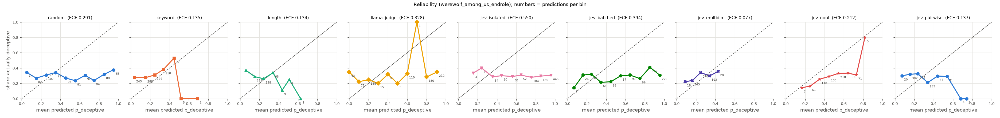
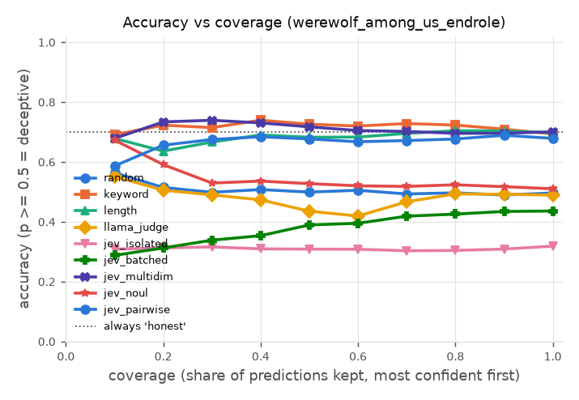
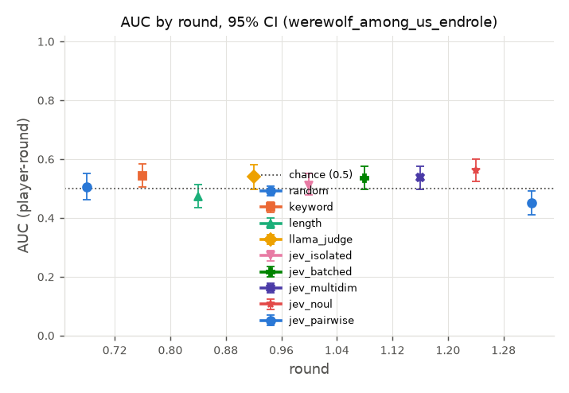

# Judge report: human_wau_endrole

Generated 2026-09-27 12:57 by `python -m ww.eval.report --sources werewolf_among_us_endrole --judges random-f760e1b3a694,keyword-e6b64872a12e,length-daf73ce8d4a6,llama_judge-c990a3c24747,jev_isolated-8b754593c8ab,jev_batched-0650211bf044,jev_multidim-48946ed5491a,jev_noul-e99507152316,jev_pairwise-7be3255d4c01 --out reports/human_wau_endrole.md`.
Data: `B:\jev-blackjack\data`. Every number below is computed from the transcript and judgment files listed here.
CIs: 95% percentile bootstrap resampling whole games (1000 replicates, seed 0). Where two judges' CIs overlap, the table alone does not show a difference; use the paired comparisons.

Unit of analysis: *player-round* = one judge score for one player who spoke in that round's view (views include all earlier rounds). *Per statement* weights each score by how many statements the player made that round.

## Judges and data

| Judge | Judge key | Config |
|---|---|---|
| random | `random-f760e1b3a694` | seed=0, version=1 |
| keyword | `keyword-e6b64872a12e` | cues={'hedge': ['maybe', 'perhaps', 'possibly', 'probably', 'm..., scale=10.0, version=1, weights={'hedge': 1.0, 'accusation': 1.0, 'defensive': 1.5} |
| length | `length-daf73ce8d4a6` | scale=5000.0, version=1 |
| llama_judge | `llama_judge-c990a3c24747` | include_defense=True, json_mode=True, max_retries=1, model=llama3.1:8b, prompt_sha=764b9cfffb06, seed=0, temperature=0.0, version=1, view_window={'version': 1, 'max_state_chars': 90000} |
| jev_isolated | `jev_isolated-8b754593c8ab` | criteria=['consistent, specific, and forthcoming', 'somewhat vague..., criteria_variant=generic, include_defense=True, model=jev-1.13.0, version=1 |
| jev_batched | `jev_batched-0650211bf044` | criteria=['consistent, specific, and forthcoming', 'somewhat vague..., criteria_variant=generic, include_defense=True, model=jev-1.13.0, version=1, view_window={'version': 1, 'max_state_chars': 90000} |
| jev_multidim | `jev_multidim-48946ed5491a` | dimensions={'evasiveness': {'instructions': 'This is the public reco..., include_defense=True, model=jev-1.13.0, version=1, view_window={'version': 1, 'max_state_chars': 90000} |
| jev_noul | `jev_noul-e99507152316` | include_defense=True, model=jev-1.13.0, question={'instructions': 'This is the public record of a social d..., version=1, view_window={'version': 1, 'max_state_chars': 90000} |
| jev_pairwise | `jev_pairwise-7be3255d4c01` | include_defense=True, model=jev-1.13.0, question={'instructions': 'This is the public record of a social d..., version=1, view_window={'version': 1, 'max_state_chars': 90000} |

| Judge | Source | Games judged | Complete | Transcripts |
|---|---|---|---|---|
| random | werewolf_among_us_endrole | 191 | 191 | 191 |
| keyword | werewolf_among_us_endrole | 191 | 191 | 191 |
| length | werewolf_among_us_endrole | 191 | 191 | 191 |
| llama_judge | werewolf_among_us_endrole | 191 | 191 | 191 |
| jev_isolated | werewolf_among_us_endrole | 191 | 191 | 191 |
| jev_batched | werewolf_among_us_endrole | 191 | 191 | 191 |
| jev_multidim | werewolf_among_us_endrole | 191 | 191 | 191 |
| jev_noul | werewolf_among_us_endrole | 191 | 191 | 191 |
| jev_pairwise | werewolf_among_us_endrole | 191 | 191 | 191 |

## Source: `werewolf_among_us_endrole`

### Accuracy and calibration

| Judge | Games | AUC player-round | AUC per statement | Round-1 top-1 | R1 chance | Top-1 minus chance | ECE | Brier | Acc @ 50% coverage | Acc @ 100% | Confidence used |
|---|---|---|---|---|---|---|---|---|---|---|---|
| random | 191 | 0.506 [0.461, 0.552] | 0.508 [0.458, 0.560] | 0.319 [0.257, 0.387] | 0.302 [0.279, 0.324] | 0.018 [-0.043, 0.080] | 0.291 [0.263, 0.327] | 0.331 [0.310, 0.352] | 0.499 [0.448, 0.555] | 0.496 [0.460, 0.530] | abs(p-0.5) |
| keyword | 191 | 0.544 [0.504, 0.583] | 0.560 [0.519, 0.604] | 0.332 [0.264, 0.398] | 0.302 [0.279, 0.324] | 0.031 [-0.028, 0.089] | 0.135 [0.116, 0.157] | 0.232 [0.217, 0.247] | 0.726 [0.690, 0.762] | 0.693 [0.672, 0.715] | abs(p-0.5) |
| length | 191 | 0.473 [0.434, 0.512] | 0.497 [0.453, 0.543] | 0.267 [0.209, 0.335] | 0.302 [0.279, 0.324] | -0.035 [-0.090, 0.028] | 0.134 [0.118, 0.161] | 0.237 [0.221, 0.253] | 0.682 [0.641, 0.722] | 0.697 [0.675, 0.718] | abs(p-0.5) |
| llama_judge | 191 | 0.540 [0.498, 0.581] | 0.551 [0.505, 0.596] | 0.366 [0.301, 0.428] | 0.302 [0.279, 0.324] | 0.064 [0.002, 0.123] | 0.328 [0.300, 0.355] | 0.359 [0.339, 0.378] | 0.435 [0.395, 0.473] | 0.489 [0.458, 0.521] | abs(p-0.5) |
| jev_isolated | 191 | 0.511 [0.477, 0.550] | 0.507 [0.466, 0.553] | 0.284 [0.225, 0.345] | 0.302 [0.279, 0.324] | -0.017 [-0.069, 0.041] | 0.550 [0.528, 0.575] | 0.534 [0.516, 0.552] | 0.308 [0.277, 0.345] | 0.318 [0.296, 0.342] | judge |
| jev_batched | 191 | 0.535 [0.496, 0.575] | 0.531 [0.489, 0.571] | 0.304 [0.238, 0.367] | 0.302 [0.279, 0.324] | 0.002 [-0.062, 0.066] | 0.394 [0.368, 0.423] | 0.400 [0.380, 0.420] | 0.389 [0.346, 0.428] | 0.436 [0.404, 0.468] | judge |
| jev_multidim | 191 | 0.537 [0.497, 0.575] | 0.536 [0.493, 0.575] | 0.330 [0.267, 0.393] | 0.302 [0.279, 0.324] | 0.028 [-0.031, 0.085] | 0.077 [0.054, 0.103] | 0.215 [0.204, 0.227] | 0.717 [0.684, 0.753] | 0.700 [0.679, 0.722] | judge |
| jev_noul | 191 | 0.562 [0.524, 0.599] | 0.558 [0.518, 0.597] | 0.317 [0.254, 0.382] | 0.302 [0.279, 0.324] | 0.015 [-0.048, 0.075] | 0.212 [0.193, 0.235] | 0.261 [0.252, 0.270] | 0.527 [0.479, 0.572] | 0.510 [0.477, 0.543] | abs(p-0.5) |
| jev_pairwise | 191 | 0.451 [0.409, 0.490] | 0.447 [0.406, 0.489] | 0.252 [0.211, 0.294] | 0.302 [0.279, 0.324] | -0.049 [-0.084, -0.014] | 0.137 [0.111, 0.164] | 0.233 [0.220, 0.247] | 0.676 [0.640, 0.710] | 0.678 [0.653, 0.704] | abs(p-0.5) |

- Ranked by AUC (player-round): jev_noul > keyword > llama_judge > jev_multidim > jev_batched > jev_isolated > random > length > jev_pairwise
- Ranked by round-1 top-1: llama_judge > keyword > jev_multidim > random > jev_noul > jev_batched > jev_isolated > length > jev_pairwise
- Ranked by ECE (lower is better): jev_multidim < length < keyword < jev_pairwise < jev_noul < random < llama_judge < jev_batched < jev_isolated
- Rankings order point estimates only; see the paired comparisons below for which gaps are real.
- Chance: AUC 0.5; round-1 top-1 = mean over games of n_deceptive / n_scored_players (column R1 chance). Always answering 'honest' scores accuracy 0.700 on these rows.

### Cost and latency (per judge.score call = one round's view)

| Judge | Calls | Mean latency s | Median s | p95 s | Total cost | Cost per game |
|---|---|---|---|---|---|---|
| random | 191 | 0.00 [0.00, 0.00] | 0.00 | 0.00 | $0.0000 | $0.0000 [$0.0000, $0.0000] |
| keyword | 191 | 0.00 [0.00, 0.00] | 0.00 | 0.00 | $0.0000 | $0.0000 [$0.0000, $0.0000] |
| length | 191 | 0.00 [0.00, 0.00] | 0.00 | 0.00 | $0.0000 | $0.0000 [$0.0000, $0.0000] |
| llama_judge | 191 | 4.89 [4.71, 5.08] | 4.69 | 7.49 | $0.0000 | $0.0000 [$0.0000, $0.0000] |
| jev_isolated | 191 | 0.27 [0.26, 0.28] | 0.23 | 0.39 | $0.0380 | $0.0002 [$0.0002, $0.0002] |
| jev_batched | 191 | 0.20 [0.20, 0.21] | 0.20 | 0.25 | $0.0347 | $0.0002 [$0.0002, $0.0002] |
| jev_multidim | 191 | 0.22 [0.22, 0.23] | 0.21 | 0.28 | $0.0514 | $0.0003 [$0.0003, $0.0003] |
| jev_noul | 191 | 0.20 [0.19, 0.20] | 0.19 | 0.26 | $0.0342 | $0.0002 [$0.0002, $0.0002] |
| jev_pairwise | 191 | 0.20 [0.20, 0.21] | 0.20 | 0.26 | $0.0447 | $0.0002 [$0.0002, $0.0002] |

n/a cost = the judge did not report `meta.cost_usd`.

### AUC by round

| Round | random | keyword | length | llama_judge | jev_isolated | jev_batched | jev_multidim | jev_noul | jev_pairwise |
|---|---|---|---|---|---|---|---|---|---|
| 1 | 0.506 [0.461, 0.552] (n=191) | 0.544 [0.504, 0.583] (n=191) | 0.473 [0.434, 0.512] (n=191) | 0.540 [0.498, 0.581] (n=191) | 0.511 [0.477, 0.550] (n=191) | 0.535 [0.496, 0.575] (n=191) | 0.537 [0.497, 0.575] (n=191) | 0.562 [0.524, 0.599] (n=191) | 0.451 [0.409, 0.490] (n=191) |

n = games with that round judged. The plot shows rounds with at least 5 games.

### Paired comparisons (X minus Y, same games)

| X | Y | Metric | X - Y | 95% CI | p | Games | Verdict |
|---|---|---|---|---|---|---|---|
| random | keyword | AUC (player-round) | -0.038 | [-0.096, +0.023] | 0.216 | 191 | inconclusive (CI includes 0) |
| random | keyword | Round-1 top-1 | -0.013 | [-0.099, +0.076] | 0.770 | 191 | inconclusive (CI includes 0) |
| random | keyword | ECE | +0.156 | [+0.116, +0.197] | <0.002 | 191 | keyword better |
| random | length | AUC (player-round) | +0.032 | [-0.028, +0.098] | 0.298 | 191 | inconclusive (CI includes 0) |
| random | length | Round-1 top-1 | +0.052 | [-0.031, +0.141] | 0.270 | 191 | inconclusive (CI includes 0) |
| random | length | ECE | +0.157 | [+0.115, +0.197] | <0.002 | 191 | length better |
| random | llama_judge | AUC (player-round) | -0.034 | [-0.093, +0.026] | 0.264 | 191 | inconclusive (CI includes 0) |
| random | llama_judge | Round-1 top-1 | -0.046 | [-0.129, +0.041] | 0.288 | 191 | inconclusive (CI includes 0) |
| random | llama_judge | ECE | -0.036 | [-0.073, +0.007] | 0.118 | 191 | inconclusive (CI includes 0) |
| random | jev_isolated | AUC (player-round) | -0.006 | [-0.064, +0.049] | 0.850 | 191 | inconclusive (CI includes 0) |
| random | jev_isolated | Round-1 top-1 | +0.035 | [-0.050, +0.118] | 0.424 | 191 | inconclusive (CI includes 0) |
| random | jev_isolated | ECE | -0.259 | [-0.293, -0.219] | <0.002 | 191 | random better |
| random | jev_batched | AUC (player-round) | -0.029 | [-0.090, +0.029] | 0.316 | 191 | inconclusive (CI includes 0) |
| random | jev_batched | Round-1 top-1 | +0.016 | [-0.073, +0.107] | 0.720 | 191 | inconclusive (CI includes 0) |
| random | jev_batched | ECE | -0.103 | [-0.140, -0.060] | <0.002 | 191 | random better |
| random | jev_multidim | AUC (player-round) | -0.031 | [-0.087, +0.025] | 0.270 | 191 | inconclusive (CI includes 0) |
| random | jev_multidim | Round-1 top-1 | -0.010 | [-0.099, +0.079] | 0.890 | 191 | inconclusive (CI includes 0) |
| random | jev_multidim | ECE | +0.214 | [+0.175, +0.257] | <0.002 | 191 | jev_multidim better |
| random | jev_noul | AUC (player-round) | -0.056 | [-0.110, +0.003] | 0.058 | 191 | inconclusive (CI includes 0) |
| random | jev_noul | Round-1 top-1 | +0.003 | [-0.076, +0.089] | 0.942 | 191 | inconclusive (CI includes 0) |
| random | jev_noul | ECE | +0.079 | [+0.044, +0.120] | <0.002 | 191 | jev_noul better |
| random | jev_pairwise | AUC (player-round) | +0.055 | [-0.004, +0.120] | 0.068 | 191 | inconclusive (CI includes 0) |
| random | jev_pairwise | Round-1 top-1 | +0.067 | [-0.003, +0.143] | 0.068 | 191 | inconclusive (CI includes 0) |
| random | jev_pairwise | ECE | +0.154 | [+0.111, +0.203] | <0.002 | 191 | jev_pairwise better |
| keyword | length | AUC (player-round) | +0.070 | [+0.021, +0.122] | 0.008 | 191 | keyword better |
| keyword | length | Round-1 top-1 | +0.065 | [-0.021, +0.147] | 0.154 | 191 | inconclusive (CI includes 0) |
| keyword | length | ECE | +0.001 | [-0.021, +0.014] | 0.854 | 191 | inconclusive (CI includes 0) |
| keyword | llama_judge | AUC (player-round) | +0.004 | [-0.054, +0.061] | 0.912 | 191 | inconclusive (CI includes 0) |
| keyword | llama_judge | Round-1 top-1 | -0.033 | [-0.119, +0.052] | 0.476 | 191 | inconclusive (CI includes 0) |
| keyword | llama_judge | ECE | -0.193 | [-0.227, -0.154] | <0.002 | 191 | keyword better |
| keyword | jev_isolated | AUC (player-round) | +0.033 | [-0.016, +0.079] | 0.216 | 191 | inconclusive (CI includes 0) |
| keyword | jev_isolated | Round-1 top-1 | +0.048 | [-0.031, +0.129] | 0.258 | 191 | inconclusive (CI includes 0) |
| keyword | jev_isolated | ECE | -0.415 | [-0.456, -0.376] | <0.002 | 191 | keyword better |
| keyword | jev_batched | AUC (player-round) | +0.009 | [-0.042, +0.056] | 0.754 | 191 | inconclusive (CI includes 0) |
| keyword | jev_batched | Round-1 top-1 | +0.029 | [-0.055, +0.107] | 0.480 | 191 | inconclusive (CI includes 0) |
| keyword | jev_batched | ECE | -0.259 | [-0.297, -0.219] | <0.002 | 191 | keyword better |
| keyword | jev_multidim | AUC (player-round) | +0.007 | [-0.046, +0.059] | 0.756 | 191 | inconclusive (CI includes 0) |
| keyword | jev_multidim | Round-1 top-1 | +0.003 | [-0.071, +0.079] | 0.924 | 191 | inconclusive (CI includes 0) |
| keyword | jev_multidim | ECE | +0.058 | [+0.034, +0.083] | <0.002 | 191 | jev_multidim better |
| keyword | jev_noul | AUC (player-round) | -0.018 | [-0.068, +0.031] | 0.494 | 191 | inconclusive (CI includes 0) |
| keyword | jev_noul | Round-1 top-1 | +0.016 | [-0.063, +0.105] | 0.678 | 191 | inconclusive (CI includes 0) |
| keyword | jev_noul | ECE | -0.077 | [-0.115, -0.038] | <0.002 | 191 | keyword better |
| keyword | jev_pairwise | AUC (player-round) | +0.093 | [+0.039, +0.152] | <0.002 | 191 | keyword better |
| keyword | jev_pairwise | Round-1 top-1 | +0.080 | [+0.013, +0.149] | 0.020 | 191 | keyword better |
| keyword | jev_pairwise | ECE | -0.002 | [-0.028, +0.028] | 0.938 | 191 | inconclusive (CI includes 0) |
| length | llama_judge | AUC (player-round) | -0.066 | [-0.119, -0.016] | 0.008 | 191 | llama_judge better |
| length | llama_judge | Round-1 top-1 | -0.099 | [-0.181, -0.017] | 0.022 | 191 | llama_judge better |
| length | llama_judge | ECE | -0.194 | [-0.226, -0.153] | <0.002 | 191 | length better |
| length | jev_isolated | AUC (player-round) | -0.038 | [-0.084, +0.006] | 0.074 | 191 | inconclusive (CI includes 0) |
| length | jev_isolated | Round-1 top-1 | -0.017 | [-0.099, +0.063] | 0.700 | 191 | inconclusive (CI includes 0) |
| length | jev_isolated | ECE | -0.416 | [-0.454, -0.372] | <0.002 | 191 | length better |
| length | jev_batched | AUC (player-round) | -0.062 | [-0.106, -0.020] | 0.004 | 191 | jev_batched better |
| length | jev_batched | Round-1 top-1 | -0.037 | [-0.110, +0.037] | 0.386 | 191 | inconclusive (CI includes 0) |
| length | jev_batched | ECE | -0.260 | [-0.293, -0.218] | <0.002 | 191 | length better |
| length | jev_multidim | AUC (player-round) | -0.063 | [-0.113, -0.014] | 0.012 | 191 | jev_multidim better |
| length | jev_multidim | Round-1 top-1 | -0.063 | [-0.147, +0.021] | 0.168 | 191 | inconclusive (CI includes 0) |
| length | jev_multidim | ECE | +0.057 | [+0.036, +0.087] | <0.002 | 191 | jev_multidim better |
| length | jev_noul | AUC (player-round) | -0.088 | [-0.138, -0.040] | <0.002 | 191 | jev_noul better |
| length | jev_noul | Round-1 top-1 | -0.050 | [-0.128, +0.042] | 0.306 | 191 | inconclusive (CI includes 0) |
| length | jev_noul | ECE | -0.079 | [-0.112, -0.035] | <0.002 | 191 | length better |
| length | jev_pairwise | AUC (player-round) | +0.023 | [-0.025, +0.075] | 0.378 | 191 | inconclusive (CI includes 0) |
| length | jev_pairwise | Round-1 top-1 | +0.015 | [-0.051, +0.087] | 0.648 | 191 | inconclusive (CI includes 0) |
| length | jev_pairwise | ECE | -0.003 | [-0.026, +0.030] | 0.928 | 191 | inconclusive (CI includes 0) |
| llama_judge | jev_isolated | AUC (player-round) | +0.028 | [-0.018, +0.075] | 0.246 | 191 | inconclusive (CI includes 0) |
| llama_judge | jev_isolated | Round-1 top-1 | +0.081 | [-0.002, +0.156] | 0.060 | 191 | inconclusive (CI includes 0) |
| llama_judge | jev_isolated | ECE | -0.222 | [-0.253, -0.191] | <0.002 | 191 | llama_judge better |
| llama_judge | jev_batched | AUC (player-round) | +0.005 | [-0.033, +0.044] | 0.826 | 191 | inconclusive (CI includes 0) |
| llama_judge | jev_batched | Round-1 top-1 | +0.062 | [-0.010, +0.134] | 0.088 | 191 | inconclusive (CI includes 0) |
| llama_judge | jev_batched | ECE | -0.067 | [-0.099, -0.032] | <0.002 | 191 | llama_judge better |
| llama_judge | jev_multidim | AUC (player-round) | +0.003 | [-0.041, +0.049] | 0.892 | 191 | inconclusive (CI includes 0) |
| llama_judge | jev_multidim | Round-1 top-1 | +0.036 | [-0.051, +0.120] | 0.412 | 191 | inconclusive (CI includes 0) |
| llama_judge | jev_multidim | ECE | +0.251 | [+0.211, +0.290] | <0.002 | 191 | jev_multidim better |
| llama_judge | jev_noul | AUC (player-round) | -0.022 | [-0.060, +0.020] | 0.306 | 191 | inconclusive (CI includes 0) |
| llama_judge | jev_noul | Round-1 top-1 | +0.049 | [-0.024, +0.128] | 0.198 | 191 | inconclusive (CI includes 0) |
| llama_judge | jev_noul | ECE | +0.115 | [+0.083, +0.145] | <0.002 | 191 | jev_noul better |
| llama_judge | jev_pairwise | AUC (player-round) | +0.089 | [+0.031, +0.149] | 0.002 | 191 | llama_judge better |
| llama_judge | jev_pairwise | Round-1 top-1 | +0.113 | [+0.042, +0.187] | <0.002 | 191 | llama_judge better |
| llama_judge | jev_pairwise | ECE | +0.190 | [+0.149, +0.230] | <0.002 | 191 | jev_pairwise better |
| jev_isolated | jev_batched | AUC (player-round) | -0.024 | [-0.054, +0.011] | 0.174 | 191 | inconclusive (CI includes 0) |
| jev_isolated | jev_batched | Round-1 top-1 | -0.019 | [-0.090, +0.059] | 0.634 | 191 | inconclusive (CI includes 0) |
| jev_isolated | jev_batched | ECE | +0.156 | [+0.133, +0.176] | <0.002 | 191 | jev_batched better |
| jev_isolated | jev_multidim | AUC (player-round) | -0.026 | [-0.067, +0.016] | 0.290 | 191 | inconclusive (CI includes 0) |
| jev_isolated | jev_multidim | Round-1 top-1 | -0.045 | [-0.119, +0.034] | 0.264 | 191 | inconclusive (CI includes 0) |
| jev_isolated | jev_multidim | ECE | +0.473 | [+0.435, +0.514] | <0.002 | 191 | jev_multidim better |
| jev_isolated | jev_noul | AUC (player-round) | -0.050 | [-0.089, -0.009] | 0.014 | 191 | jev_noul better |
| jev_isolated | jev_noul | Round-1 top-1 | -0.032 | [-0.110, +0.051] | 0.482 | 191 | inconclusive (CI includes 0) |
| jev_isolated | jev_noul | ECE | +0.338 | [+0.323, +0.350] | <0.002 | 191 | jev_noul better |
| jev_isolated | jev_pairwise | AUC (player-round) | +0.061 | [+0.007, +0.118] | 0.034 | 191 | jev_isolated better |
| jev_isolated | jev_pairwise | Round-1 top-1 | +0.032 | [-0.038, +0.106] | 0.336 | 191 | inconclusive (CI includes 0) |
| jev_isolated | jev_pairwise | ECE | +0.413 | [+0.373, +0.456] | <0.002 | 191 | jev_pairwise better |
| jev_batched | jev_multidim | AUC (player-round) | -0.002 | [-0.031, +0.027] | 0.962 | 191 | inconclusive (CI includes 0) |
| jev_batched | jev_multidim | Round-1 top-1 | -0.026 | [-0.086, +0.037] | 0.460 | 191 | inconclusive (CI includes 0) |
| jev_batched | jev_multidim | ECE | +0.317 | [+0.278, +0.357] | <0.002 | 191 | jev_multidim better |
| jev_batched | jev_noul | AUC (player-round) | -0.026 | [-0.054, +0.001] | 0.060 | 191 | inconclusive (CI includes 0) |
| jev_batched | jev_noul | Round-1 top-1 | -0.013 | [-0.079, +0.052] | 0.768 | 191 | inconclusive (CI includes 0) |
| jev_batched | jev_noul | ECE | +0.182 | [+0.162, +0.202] | <0.002 | 191 | jev_noul better |
| jev_batched | jev_pairwise | AUC (player-round) | +0.084 | [+0.027, +0.146] | 0.002 | 191 | jev_batched better |
| jev_batched | jev_pairwise | Round-1 top-1 | +0.051 | [-0.018, +0.125] | 0.160 | 191 | inconclusive (CI includes 0) |
| jev_batched | jev_pairwise | ECE | +0.257 | [+0.216, +0.297] | <0.002 | 191 | jev_pairwise better |
| jev_multidim | jev_noul | AUC (player-round) | -0.025 | [-0.057, +0.007] | 0.124 | 191 | inconclusive (CI includes 0) |
| jev_multidim | jev_noul | Round-1 top-1 | +0.013 | [-0.052, +0.079] | 0.698 | 191 | inconclusive (CI includes 0) |
| jev_multidim | jev_noul | ECE | -0.135 | [-0.175, -0.095] | <0.002 | 191 | jev_multidim better |
| jev_multidim | jev_pairwise | AUC (player-round) | +0.086 | [+0.026, +0.149] | 0.006 | 191 | jev_multidim better |
| jev_multidim | jev_pairwise | Round-1 top-1 | +0.078 | [+0.010, +0.150] | 0.024 | 191 | jev_multidim better |
| jev_multidim | jev_pairwise | ECE | -0.060 | [-0.093, -0.025] | <0.002 | 191 | jev_multidim better |
| jev_noul | jev_pairwise | AUC (player-round) | +0.111 | [+0.055, +0.169] | <0.002 | 191 | jev_noul better |
| jev_noul | jev_pairwise | Round-1 top-1 | +0.065 | [-0.008, +0.142] | 0.100 | 191 | inconclusive (CI includes 0) |
| jev_noul | jev_pairwise | ECE | +0.075 | [+0.039, +0.116] | <0.002 | 191 | jev_pairwise better |

p = two-sided paired-bootstrap p-value (its resolution is limited by the number of replicates). For ECE, lower is better, so a negative X - Y favors X.

### Plots

