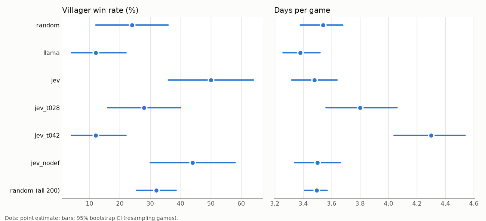

# Live games: a judge decides the vote

<!-- INTERPRETATION START -->
## Interpretation

**In live play, letting Jev pick the vote helps villagers. Letting llama pick it hurts them.** These are paired comparisons on the same 50 seat and role setups:

- **jev** (jev_batched, defense on, no abstention): villagers win **50% [36, 64]**, against **24% [12, 36]** under random votes, a gain of **+26 pp [+12, +40]**. It also votes out more wolves per game (+0.34 [+0.10, +0.58]). The 50 random games happen to be an unlucky draw: all 200 random games give 32% [26, 38]. That CI still does not overlap jev's.
- **llama** (llama_judge): villagers win 12% [4, 22]. Against random the difference is inconclusive (-12 pp [-26, +2]), but llama votes out fewer wolves than random (-0.38 [-0.64, -0.12]) and loses clearly to jev (-38 pp [-56, -22]). This matches the offline result in core.md, where llama_judge's AUC is below chance.
- **Abstention hurts.** Skipping the vote when Jev's confidence is low only gives the wolves extra nights. jev_t028 wins 28% and jev_t042 wins 12%, both clearly below jev (-22 pp and -38 pp). Their top suspect is a wolf about as often as jev's (37% and 34% vs 36%). The rest of the loss comes from the days with no elimination (33% and 66% of days). `jev_t061` was not run (the user dropped it).
- **The defense step shows no measurable effect.** jev_nodef (one score per day) wins 44% against jev's 50%, a difference of -6 pp [-24, +12], so the test is inconclusive. It needs half the Jev calls (3.5 vs 7.0 per game).
- **Cost:** a Jev-driven game costs $0.0007 (7 calls). Across all 246 Jev live games, the log totals 1,645 calls and $0.166.

Caveats: every player is llama3.1:8b with the generic persona, and 50 games per condition leaves wide CIs. "Top suspect is a wolf" pools days whose number of living players differs, so its chance level is only 2/9 on day 1.
<!-- INTERPRETATION END -->

---

Generated 2026-09-27 12:14 by `python -m ww.live.report --out reports/live.md`. Data: `B:\jev-blackjack\data`. CIs: 95% percentile bootstrap resampling whole games (2000 replicates, seed 0). Paired differences use the game indices present in both conditions; game i has the same seats and roles in every condition.

## Conditions

| Condition | Source | Games | Setup |
|---|---|---|---|
| random | `llm_llama31_8b` (indices 0..49) | 50 | Wave 2 generator: uniformly random day votes (no judge) |
| llama | `live_llama` | 50 | llama_judge, defense, no abstention |
| jev | `live_jev` | 50 | jev_batched, defense, no abstention |
| jev_t028 | `live_jev_t028` | 50 | jev_batched, defense, abstain if conf < 0.28 |
| jev_t042 | `live_jev_t042` | 50 | jev_batched, defense, abstain if conf < 0.42 |
| jev_nodef | `live_jev_nodef` | 50 | jev_batched without defenses (one score per day), no abstention |
| random (all 200) | `llm_llama31_8b` (indices 0..199) | 200 | Wave 2 generator: uniformly random day votes (no judge) |

All conditions: 9 players (2 wolves, 1 Seer), llama3.1:8b for every player, generic werewolf persona, temperature 0.8, random night kills, roles revealed on death. Judge conditions: the judge's top suspect gives the day's defense; with the defense on, the judge re-scores after it; the final top suspect is voted out unless abstention applies (then nobody is, and the wolves still kill at night).

## Outcomes

| Condition | Games | Villager win rate | Days per game | Wolves voted out / game | Villagers voted out / game | Days with no elimination | Top suspect is a wolf (per day) | Day-1 elimination is a wolf | Jev calls / game | Jev cost / game |
|---|---|---|---|---|---|---|---|---|---|---|
| random | 50 | 24% [12, 36] | 3.54 [3.38, 3.68] | 0.92 [0.72, 1.12] | 2.62 [2.40, 2.82] | 0% [0, 0] | n/a | 28% [16, 40] | - | - |
| llama | 50 | 12% [4, 22] | 3.38 [3.26, 3.52] | 0.54 [0.36, 0.74] | 2.84 [2.70, 2.96] | 0% [0, 0] | 16% [11, 22] | 12% [4, 22] | - | - |
| jev | 50 | 50% [36, 64] | 3.48 [3.32, 3.64] | 1.26 [1.02, 1.50] | 2.22 [1.94, 2.46] | 0% [0, 0] | 36% [30, 43] | 20% [10, 32] | 7.0 | $0.00068 |
| jev_t028 | 50 | 28% [16, 40] | 3.80 [3.56, 4.06] | 0.90 [0.68, 1.12] | 1.66 [1.44, 1.88] | 33% [24, 41] | 37% [30, 45] | 24% [13, 36] | 7.6 | $0.00078 |
| jev_t042 | 50 | 12% [4, 22] | 4.30 [4.04, 4.54] | 0.60 [0.42, 0.78] | 0.88 [0.70, 1.06] | 66% [59, 72] | 34% [26, 42] | 31% [16, 48] | 8.6 | $0.00095 |
| jev_nodef | 50 | 44% [30, 58] | 3.50 [3.34, 3.66] | 1.20 [0.98, 1.42] | 2.30 [2.04, 2.56] | 0% [0, 0] | 34% [28, 41] | 20% [10, 32] | 3.5 | $0.00032 |
| random (all 200) | 200 | 32% [26, 38] | 3.50 [3.41, 3.57] | 1.01 [0.90, 1.12] | 2.48 [2.37, 2.60] | 0% [0, 0] | n/a | 22% [17, 29] | - | - |

Rates marked with % pool days (or games) across the condition; 'Top suspect is a wolf' counts the judge's final top suspect each day, whether or not it abstained. Chance for a uniformly random top suspect on day 1 is 2/9 = 22%.

## Paired comparisons (X minus Y, same game indices)

| X | Y | Metric | X - Y | 95% CI | p | Games | Verdict |
|---|---|---|---|---|---|---|---|
| llama | random | Villager win rate | -12.00 pp | [-26.00, +2.00] | 0.125 | 50 | inconclusive (CI includes 0) |
| llama | random | Days per game | -0.16 | [-0.36, +0.06] | 0.183 | 50 | inconclusive (CI includes 0) |
| llama | random | Wolves voted out / game | -0.38 | [-0.64, -0.12] | 0.005 | 50 | X lower |
| jev | random | Villager win rate | +26.00 pp | [+12.00, +40.00] | <0.001 | 50 | X higher |
| jev | random | Days per game | -0.06 | [-0.26, +0.14] | 0.641 | 50 | inconclusive (CI includes 0) |
| jev | random | Wolves voted out / game | +0.34 | [+0.10, +0.58] | 0.008 | 50 | X higher |
| jev_t028 | random | Villager win rate | +4.00 pp | [-10.00, +18.00] | 0.712 | 50 | inconclusive (CI includes 0) |
| jev_t028 | random | Days per game | +0.26 | [-0.02, +0.58] | 0.087 | 50 | inconclusive (CI includes 0) |
| jev_t028 | random | Wolves voted out / game | -0.02 | [-0.28, +0.24] | 0.942 | 50 | inconclusive (CI includes 0) |
| jev_t042 | random | Villager win rate | -12.00 pp | [-26.00, +2.00] | 0.124 | 50 | inconclusive (CI includes 0) |
| jev_t042 | random | Days per game | +0.76 | [+0.48, +1.04] | <0.001 | 50 | X higher |
| jev_t042 | random | Wolves voted out / game | -0.32 | [-0.54, -0.10] | 0.011 | 50 | X lower |
| jev_nodef | random | Villager win rate | +20.00 pp | [+4.00, +36.00] | 0.025 | 50 | X higher |
| jev_nodef | random | Days per game | -0.04 | [-0.28, +0.20] | 0.851 | 50 | inconclusive (CI includes 0) |
| jev_nodef | random | Wolves voted out / game | +0.28 | [+0.00, +0.56] | 0.052 | 50 | inconclusive (CI includes 0) |
| llama | jev | Villager win rate | -38.00 pp | [-56.00, -22.00] | <0.001 | 50 | X lower |
| llama | jev | Days per game | -0.10 | [-0.30, +0.12] | 0.416 | 50 | inconclusive (CI includes 0) |
| llama | jev | Wolves voted out / game | -0.72 | [-1.00, -0.42] | <0.001 | 50 | X lower |
| jev_t028 | jev | Villager win rate | -22.00 pp | [-40.00, -4.00] | 0.016 | 50 | X lower |
| jev_t028 | jev | Days per game | +0.32 | [+0.02, +0.64] | 0.042 | 50 | X higher |
| jev_t028 | jev | Wolves voted out / game | -0.36 | [-0.66, -0.08] | 0.014 | 50 | X lower |
| jev_t042 | jev | Villager win rate | -38.00 pp | [-52.00, -24.00] | <0.001 | 50 | X lower |
| jev_t042 | jev | Days per game | +0.82 | [+0.58, +1.04] | <0.001 | 50 | X higher |
| jev_t042 | jev | Wolves voted out / game | -0.66 | [-0.92, -0.42] | <0.001 | 50 | X lower |
| jev_nodef | jev | Villager win rate | -6.00 pp | [-24.00, +12.00] | 0.570 | 50 | inconclusive (CI includes 0) |
| jev_nodef | jev | Days per game | +0.02 | [-0.20, +0.22] | 0.904 | 50 | inconclusive (CI includes 0) |
| jev_nodef | jev | Wolves voted out / game | -0.06 | [-0.36, +0.22] | 0.732 | 50 | inconclusive (CI includes 0) |

## How the abstention thresholds were chosen

From the 699 offline jev_batched views of `llm_llama31_8b` (Wave 3; judge `jev_batched-0650211bf044`, the same judge used live): the confidence Jev reports for its top suspect has 25th/50th/75th percentiles 0.28 / 0.42 / 0.61. These are the three thresholds (abstain when the top suspect's confidence is below them), i.e. abstain on roughly 25%, 50% and 75% of days if live views look like offline ones. Offline, the top suspect is a wolf this often per confidence quartile (`python -m ww.live.thresholds`):

| Confidence quartile | Range | Views | Top suspect is a wolf | Chance (wolves / speakers) |
|---|---|---|---|---|
| q1 | [0.00, 0.28] | 171 | 21.1% | 29.2% |
| q2 | [0.28, 0.42] | 172 | 36.0% | 28.0% |
| q3 | [0.42, 0.61] | 178 | 38.8% | 26.8% |
| q4 | [0.61, 1.00] | 178 | 41.6% | 25.8% |

Overall: 34.5% vs chance 27.4%. The coverage curves in core.md rank player-rounds for a yes/no call at p >= 0.5; the vote only needs the top suspect, so this table is the relevant version of that curve.

