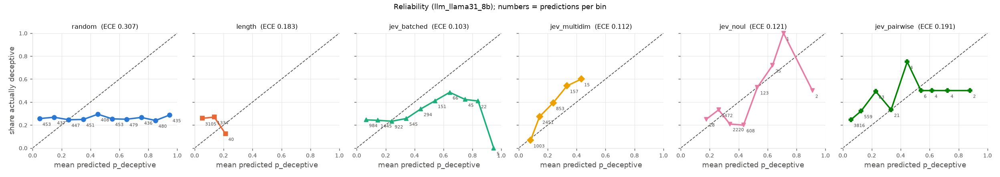
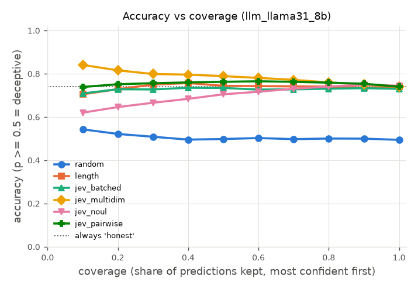
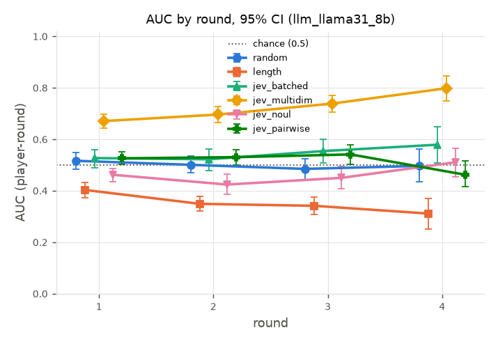

# Judge report: richer_jev_generated

Generated 2026-09-26 21:32 by `python -m ww.eval.report --sources llm_llama31_8b --judges random-f760e1b3a694,length-daf73ce8d4a6,jev_batched-0650211bf044,jev_multidim-48946ed5491a,jev_noul-e99507152316,jev_pairwise-7be3255d4c01 --out reports/richer_jev_generated.md`.
Data: `B:\jev-blackjack\data`. Every number below is computed from the transcript and judgment files listed here.
CIs: 95% percentile bootstrap resampling whole games (1000 replicates, seed 0). Where two judges' CIs overlap, the table alone does not show a difference; use the paired comparisons.

Unit of analysis: *player-round* = one judge score for one player who spoke in that round's view (views include all earlier rounds). *Per statement* weights each score by how many statements the player made that round.

## Judges and data

| Judge | Judge key | Config |
|---|---|---|
| random | `random-f760e1b3a694` | seed=0, version=1 |
| length | `length-daf73ce8d4a6` | scale=5000.0, version=1 |
| jev_batched | `jev_batched-0650211bf044` | criteria=['consistent, specific, and forthcoming', 'somewhat vague..., criteria_variant=generic, include_defense=True, model=jev-1.13.0, version=1, view_window={'version': 1, 'max_state_chars': 90000} |
| jev_multidim | `jev_multidim-48946ed5491a` | dimensions={'evasiveness': {'instructions': 'This is the public reco..., include_defense=True, model=jev-1.13.0, version=1, view_window={'version': 1, 'max_state_chars': 90000} |
| jev_noul | `jev_noul-e99507152316` | include_defense=True, model=jev-1.13.0, question={'instructions': 'This is the public record of a social d..., version=1, view_window={'version': 1, 'max_state_chars': 90000} |
| jev_pairwise | `jev_pairwise-7be3255d4c01` | include_defense=True, model=jev-1.13.0, question={'instructions': 'This is the public record of a social d..., version=1, view_window={'version': 1, 'max_state_chars': 90000} |

| Judge | Source | Games judged | Complete | Transcripts |
|---|---|---|---|---|
| random | llm_llama31_8b | 200 | 200 | 200 |
| length | llm_llama31_8b | 200 | 200 | 200 |
| jev_batched | llm_llama31_8b | 200 | 200 | 200 |
| jev_multidim | llm_llama31_8b | 200 | 200 | 200 |
| jev_noul | llm_llama31_8b | 200 | 200 | 200 |
| jev_pairwise | llm_llama31_8b | 200 | 200 | 200 |

## Source: `llm_llama31_8b`

### Accuracy and calibration

| Judge | Games | AUC player-round | AUC per statement | Round-1 top-1 | R1 chance | Top-1 minus chance | ECE | Brier | Acc @ 50% coverage | Acc @ 100% | Confidence used |
|---|---|---|---|---|---|---|---|---|---|---|---|
| random | 200 | 0.502 [0.482, 0.521] | 0.502 [0.482, 0.521] | 0.270 [0.210, 0.335] | 0.222 [0.222, 0.222] | 0.048 [-0.012, 0.113] | 0.307 [0.296, 0.320] | 0.333 [0.326, 0.342] | 0.498 [0.478, 0.518] | 0.494 [0.481, 0.506] | abs(p-0.5) |
| length | 200 | 0.503 [0.492, 0.514] | 0.503 [0.492, 0.514] | 0.160 [0.115, 0.215] | 0.222 [0.222, 0.222] | -0.062 [-0.107, -0.007] | 0.183 [0.178, 0.188] | 0.228 [0.224, 0.231] | 0.744 [0.738, 0.751] | 0.740 [0.735, 0.745] | abs(p-0.5) |
| jev_batched | 200 | 0.542 [0.504, 0.574] | 0.542 [0.504, 0.574] | 0.280 [0.215, 0.338] | 0.222 [0.222, 0.222] | 0.058 [-0.007, 0.115] | 0.103 [0.084, 0.124] | 0.206 [0.198, 0.215] | 0.734 [0.712, 0.753] | 0.730 [0.718, 0.741] | judge |
| jev_multidim | 200 | 0.706 [0.680, 0.730] | 0.706 [0.680, 0.730] | 0.300 [0.240, 0.365] | 0.222 [0.222, 0.222] | 0.078 [0.018, 0.143] | 0.112 [0.103, 0.121] | 0.190 [0.186, 0.195] | 0.789 [0.771, 0.804] | 0.740 [0.735, 0.745] | judge |
| jev_noul | 200 | 0.449 [0.416, 0.482] | 0.449 [0.416, 0.482] | 0.246 [0.188, 0.307] | 0.222 [0.222, 0.222] | 0.024 [-0.034, 0.084] | 0.121 [0.107, 0.139] | 0.204 [0.200, 0.208] | 0.705 [0.685, 0.724] | 0.744 [0.735, 0.753] | abs(p-0.5) |
| jev_pairwise | 200 | 0.545 [0.525, 0.566] | 0.545 [0.525, 0.566] | 0.246 [0.212, 0.285] | 0.222 [0.222, 0.222] | 0.024 [-0.010, 0.062] | 0.191 [0.186, 0.197] | 0.227 [0.223, 0.232] | 0.762 [0.750, 0.776] | 0.740 [0.735, 0.745] | abs(p-0.5) |

- Ranked by AUC (player-round): jev_multidim > jev_pairwise > jev_batched > length > random > jev_noul
- Ranked by round-1 top-1: jev_multidim > jev_batched > random > jev_pairwise = jev_noul > length
- Ranked by ECE (lower is better): jev_batched < jev_multidim < jev_noul < length < jev_pairwise < random
- Rankings order point estimates only; see the paired comparisons below for which gaps are real.
- Chance: AUC 0.5; round-1 top-1 = mean over games of n_deceptive / n_scored_players (column R1 chance). Always answering 'honest' scores accuracy 0.740 on these rows.

### Cost and latency (per judge.score call = one round's view)

| Judge | Calls | Mean latency s | Median s | p95 s | Total cost | Cost per game |
|---|---|---|---|---|---|---|
| random | 699 | 0.00 [0.00, 0.00] | 0.00 | 0.00 | $0.0000 | $0.0000 [$0.0000, $0.0000] |
| length | 699 | 0.00 [0.00, 0.00] | 0.00 | 0.00 | $0.0000 | $0.0000 [$0.0000, $0.0000] |
| jev_batched | 699 | 0.20 [0.19, 0.20] | 0.19 | 0.24 | $0.0691 | $0.0003 [$0.0003, $0.0004] |
| jev_multidim | 699 | 0.23 [0.22, 0.23] | 0.22 | 0.30 | $0.1554 | $0.0008 [$0.0008, $0.0008] |
| jev_noul | 699 | 0.19 [0.19, 0.20] | 0.18 | 0.24 | $0.0651 | $0.0003 [$0.0003, $0.0003] |
| jev_pairwise | 699 | 0.22 [0.22, 0.23] | 0.21 | 0.30 | $0.1766 | $0.0009 [$0.0009, $0.0009] |

n/a cost = the judge did not report `meta.cost_usd`.

### AUC by round

| Round | random | length | jev_batched | jev_multidim | jev_noul | jev_pairwise |
|---|---|---|---|---|---|---|
| 1 | 0.516 [0.483, 0.549] (n=200) | 0.402 [0.373, 0.433] (n=200) | 0.527 [0.490, 0.559] (n=200) | 0.670 [0.642, 0.696] (n=200) | 0.462 [0.434, 0.486] (n=200) | 0.525 [0.502, 0.552] (n=200) |
| 2 | 0.500 [0.469, 0.535] (n=200) | 0.349 [0.321, 0.379] (n=200) | 0.522 [0.479, 0.561] (n=200) | 0.696 [0.664, 0.726] (n=200) | 0.424 [0.385, 0.464] (n=200) | 0.530 [0.500, 0.559] (n=200) |
| 3 | 0.484 [0.444, 0.524] (n=191) | 0.341 [0.308, 0.375] (n=191) | 0.554 [0.507, 0.598] (n=191) | 0.738 [0.704, 0.770] (n=191) | 0.450 [0.408, 0.493] (n=191) | 0.541 [0.503, 0.577] (n=191) |
| 4 | 0.496 [0.433, 0.561] (n=108) | 0.311 [0.250, 0.370] (n=108) | 0.578 [0.507, 0.649] (n=108) | 0.798 [0.748, 0.846] (n=108) | 0.510 [0.453, 0.565] (n=108) | 0.462 [0.416, 0.515] (n=108) |

n = games with that round judged. The plot shows rounds with at least 5 games.

### Paired comparisons (X minus Y, same games)

| X | Y | Metric | X - Y | 95% CI | p | Games | Verdict |
|---|---|---|---|---|---|---|---|
| random | length | AUC (player-round) | -0.000 | [-0.024, +0.021] | 0.958 | 200 | inconclusive (CI includes 0) |
| random | length | Round-1 top-1 | +0.110 | [+0.030, +0.195] | 0.010 | 200 | random better |
| random | length | ECE | +0.123 | [+0.110, +0.140] | <0.002 | 200 | length better |
| random | jev_batched | AUC (player-round) | -0.039 | [-0.079, +0.002] | 0.058 | 200 | inconclusive (CI includes 0) |
| random | jev_batched | Round-1 top-1 | -0.010 | [-0.092, +0.078] | 0.878 | 200 | inconclusive (CI includes 0) |
| random | jev_batched | ECE | +0.204 | [+0.180, +0.228] | <0.002 | 200 | jev_batched better |
| random | jev_multidim | AUC (player-round) | -0.204 | [-0.236, -0.170] | <0.002 | 200 | jev_multidim better |
| random | jev_multidim | Round-1 top-1 | -0.030 | [-0.120, +0.055] | 0.566 | 200 | inconclusive (CI includes 0) |
| random | jev_multidim | ECE | +0.195 | [+0.180, +0.213] | <0.002 | 200 | jev_multidim better |
| random | jev_noul | AUC (player-round) | +0.054 | [+0.017, +0.091] | 0.008 | 200 | random better |
| random | jev_noul | Round-1 top-1 | +0.024 | [-0.061, +0.103] | 0.542 | 200 | inconclusive (CI includes 0) |
| random | jev_noul | ECE | +0.186 | [+0.166, +0.206] | <0.002 | 200 | jev_noul better |
| random | jev_pairwise | AUC (player-round) | -0.042 | [-0.072, -0.014] | 0.002 | 200 | jev_pairwise better |
| random | jev_pairwise | Round-1 top-1 | +0.024 | [-0.049, +0.099] | 0.500 | 200 | inconclusive (CI includes 0) |
| random | jev_pairwise | ECE | +0.116 | [+0.102, +0.132] | <0.002 | 200 | jev_pairwise better |
| length | jev_batched | AUC (player-round) | -0.039 | [-0.077, +0.003] | 0.072 | 200 | inconclusive (CI includes 0) |
| length | jev_batched | Round-1 top-1 | -0.120 | [-0.195, -0.038] | 0.008 | 200 | jev_batched better |
| length | jev_batched | ECE | +0.081 | [+0.057, +0.099] | <0.002 | 200 | jev_batched better |
| length | jev_multidim | AUC (player-round) | -0.204 | [-0.232, -0.175] | <0.002 | 200 | jev_multidim better |
| length | jev_multidim | Round-1 top-1 | -0.140 | [-0.220, -0.060] | <0.002 | 200 | jev_multidim better |
| length | jev_multidim | ECE | +0.072 | [+0.064, +0.079] | <0.002 | 200 | jev_multidim better |
| length | jev_noul | AUC (player-round) | +0.054 | [+0.017, +0.090] | 0.002 | 200 | length better |
| length | jev_noul | Round-1 top-1 | -0.086 | [-0.162, -0.007] | 0.034 | 200 | jev_noul better |
| length | jev_noul | ECE | +0.063 | [+0.044, +0.076] | <0.002 | 200 | jev_noul better |
| length | jev_pairwise | AUC (player-round) | -0.042 | [-0.063, -0.021] | <0.002 | 200 | jev_pairwise better |
| length | jev_pairwise | Round-1 top-1 | -0.086 | [-0.151, -0.015] | 0.018 | 200 | jev_pairwise better |
| length | jev_pairwise | ECE | -0.008 | [-0.012, -0.005] | <0.002 | 200 | length better |
| jev_batched | jev_multidim | AUC (player-round) | -0.165 | [-0.191, -0.141] | <0.002 | 200 | jev_multidim better |
| jev_batched | jev_multidim | Round-1 top-1 | -0.020 | [-0.087, +0.043] | 0.544 | 200 | inconclusive (CI includes 0) |
| jev_batched | jev_multidim | ECE | -0.009 | [-0.031, +0.016] | 0.520 | 200 | inconclusive (CI includes 0) |
| jev_batched | jev_noul | AUC (player-round) | +0.093 | [+0.072, +0.113] | <0.002 | 200 | jev_batched better |
| jev_batched | jev_noul | Round-1 top-1 | +0.034 | [-0.025, +0.092] | 0.278 | 200 | inconclusive (CI includes 0) |
| jev_batched | jev_noul | ECE | -0.018 | [-0.035, -0.001] | 0.040 | 200 | jev_batched better |
| jev_batched | jev_pairwise | AUC (player-round) | -0.003 | [-0.046, +0.039] | 0.854 | 200 | inconclusive (CI includes 0) |
| jev_batched | jev_pairwise | Round-1 top-1 | +0.034 | [-0.044, +0.104] | 0.418 | 200 | inconclusive (CI includes 0) |
| jev_batched | jev_pairwise | ECE | -0.089 | [-0.108, -0.066] | <0.002 | 200 | jev_batched better |
| jev_multidim | jev_noul | AUC (player-round) | +0.258 | [+0.232, +0.285] | <0.002 | 200 | jev_multidim better |
| jev_multidim | jev_noul | Round-1 top-1 | +0.054 | [+0.001, +0.108] | 0.050 | 200 | jev_multidim better |
| jev_multidim | jev_noul | ECE | -0.009 | [-0.030, +0.007] | 0.262 | 200 | inconclusive (CI includes 0) |
| jev_multidim | jev_pairwise | AUC (player-round) | +0.162 | [+0.131, +0.194] | <0.002 | 200 | jev_multidim better |
| jev_multidim | jev_pairwise | Round-1 top-1 | +0.054 | [-0.018, +0.122] | 0.164 | 200 | inconclusive (CI includes 0) |
| jev_multidim | jev_pairwise | ECE | -0.080 | [-0.087, -0.071] | <0.002 | 200 | jev_multidim better |
| jev_noul | jev_pairwise | AUC (player-round) | -0.096 | [-0.137, -0.055] | <0.002 | 200 | jev_pairwise better |
| jev_noul | jev_pairwise | Round-1 top-1 | -0.000 | [-0.075, +0.069] | 0.992 | 200 | inconclusive (CI includes 0) |
| jev_noul | jev_pairwise | ECE | -0.071 | [-0.085, -0.053] | <0.002 | 200 | jev_noul better |

p = two-sided paired-bootstrap p-value (its resolution is limited by the number of replicates). For ECE, lower is better, so a negative X - Y favors X.

### Plots

