# Judge report: richer_jev_human

Generated 2026-09-26 21:37 by `python -m ww.eval.report --sources human_mafia,llm_mafia,avalon,werewolf_among_us --judges random-f760e1b3a694,length-daf73ce8d4a6,jev_batched-0650211bf044,jev_multidim-48946ed5491a,jev_noul-e99507152316,jev_pairwise-7be3255d4c01 --out reports/richer_jev_human.md`.
Data: `B:\jev-blackjack\data`. Every number below is computed from the transcript and judgment files listed here.
CIs: 95% percentile bootstrap resampling whole games (1000 replicates, seed 0). Where two judges' CIs overlap, the table alone does not show a difference; use the paired comparisons.

Unit of analysis: *player-round* = one judge score for one player who spoke in that round's view (views include all earlier rounds). *Per statement* weights each score by how many statements the player made that round.

## Judges and data

| Judge | Judge key | Config |
|---|---|---|
| random | `random-f760e1b3a694` | seed=0, version=1 |
| length | `length-daf73ce8d4a6` | scale=5000.0, version=1 |
| jev_batched | `jev_batched-0650211bf044` | criteria=['consistent, specific, and forthcoming', 'somewhat vague..., criteria_variant=generic, include_defense=True, model=jev-1.13.0, version=1, view_window={'version': 1, 'max_state_chars': 90000} |
| jev_multidim | `jev_multidim-48946ed5491a` | dimensions={'evasiveness': {'instructions': 'This is the public reco..., include_defense=True, model=jev-1.13.0, version=1, view_window={'version': 1, 'max_state_chars': 90000} |
| jev_noul | `jev_noul-e99507152316` | include_defense=True, model=jev-1.13.0, question={'instructions': 'This is the public record of a social d..., version=1, view_window={'version': 1, 'max_state_chars': 90000} |
| jev_pairwise | `jev_pairwise-7be3255d4c01` | include_defense=True, model=jev-1.13.0, question={'instructions': 'This is the public record of a social d..., version=1, view_window={'version': 1, 'max_state_chars': 90000} |

| Judge | Source | Games judged | Complete | Transcripts |
|---|---|---|---|---|
| random | human_mafia | 44 | 44 | 44 |
| length | human_mafia | 44 | 44 | 44 |
| jev_batched | human_mafia | 44 | 44 | 44 |
| jev_multidim | human_mafia | 44 | 44 | 44 |
| jev_noul | human_mafia | 44 | 44 | 44 |
| jev_pairwise | human_mafia | 44 | 44 | 44 |
| random | llm_mafia | 35 | 35 | 35 |
| length | llm_mafia | 35 | 35 | 35 |
| jev_batched | llm_mafia | 35 | 35 | 35 |
| jev_multidim | llm_mafia | 35 | 35 | 35 |
| jev_noul | llm_mafia | 35 | 35 | 35 |
| jev_pairwise | llm_mafia | 35 | 35 | 35 |
| random | avalon | 20 | 20 | 20 |
| length | avalon | 20 | 20 | 20 |
| jev_batched | avalon | 20 | 20 | 20 |
| jev_multidim | avalon | 20 | 20 | 20 |
| jev_noul | avalon | 20 | 20 | 20 |
| jev_pairwise | avalon | 20 | 20 | 20 |
| random | werewolf_among_us | 191 | 191 | 191 |
| length | werewolf_among_us | 191 | 191 | 191 |
| jev_batched | werewolf_among_us | 191 | 191 | 191 |
| jev_multidim | werewolf_among_us | 191 | 191 | 191 |
| jev_noul | werewolf_among_us | 191 | 191 | 191 |
| jev_pairwise | werewolf_among_us | 191 | 191 | 191 |

## Source: `human_mafia`

### Accuracy and calibration

| Judge | Games | AUC player-round | AUC per statement | Round-1 top-1 | R1 chance | Top-1 minus chance | ECE | Brier | Acc @ 50% coverage | Acc @ 100% | Confidence used |
|---|---|---|---|---|---|---|---|---|---|---|---|
| random | 44 | 0.492 [0.449, 0.537] | 0.508 [0.449, 0.568] | 0.318 [0.182, 0.455] | 0.236 [0.213, 0.259] | 0.082 [-0.048, 0.214] | 0.320 [0.289, 0.363] | 0.350 [0.327, 0.373] | 0.471 [0.425, 0.519] | 0.491 [0.459, 0.530] | abs(p-0.5) |
| length | 44 | 0.532 [0.475, 0.585] | 0.475 [0.426, 0.524] | 0.170 [0.068, 0.295] | 0.236 [0.213, 0.259] | -0.066 [-0.165, 0.051] | 0.248 [0.229, 0.264] | 0.257 [0.240, 0.273] | 0.754 [0.712, 0.787] | 0.732 [0.716, 0.751] | abs(p-0.5) |
| jev_batched | 44 | 0.451 [0.386, 0.503] | 0.400 [0.331, 0.462] | 0.205 [0.113, 0.318] | 0.236 [0.213, 0.259] | -0.032 [-0.133, 0.080] | 0.195 [0.166, 0.234] | 0.270 [0.250, 0.290] | 0.591 [0.535, 0.646] | 0.588 [0.544, 0.630] | judge |
| jev_multidim | 44 | 0.444 [0.384, 0.499] | 0.456 [0.387, 0.520] | 0.341 [0.205, 0.477] | 0.236 [0.213, 0.259] | 0.105 [-0.033, 0.239] | 0.073 [0.051, 0.104] | 0.207 [0.195, 0.219] | 0.725 [0.682, 0.765] | 0.731 [0.716, 0.750] | judge |
| jev_noul | 44 | 0.464 [0.400, 0.521] | 0.431 [0.352, 0.508] | 0.193 [0.091, 0.307] | 0.236 [0.213, 0.259] | -0.043 [-0.146, 0.064] | 0.170 [0.149, 0.195] | 0.231 [0.222, 0.239] | 0.684 [0.634, 0.735] | 0.636 [0.599, 0.673] | abs(p-0.5) |
| jev_pairwise | 44 | 0.527 [0.487, 0.564] | 0.490 [0.447, 0.528] | 0.131 [0.069, 0.201] | 0.236 [0.213, 0.259] | -0.105 [-0.163, -0.044] | 0.198 [0.179, 0.217] | 0.236 [0.219, 0.250] | 0.754 [0.724, 0.782] | 0.732 [0.716, 0.751] | abs(p-0.5) |

- Ranked by AUC (player-round): length > jev_pairwise > random > jev_noul > jev_batched > jev_multidim
- Ranked by round-1 top-1: jev_multidim > random > jev_batched > jev_noul > length > jev_pairwise
- Ranked by ECE (lower is better): jev_multidim < jev_noul < jev_batched < jev_pairwise < length < random
- Rankings order point estimates only; see the paired comparisons below for which gaps are real.
- Chance: AUC 0.5; round-1 top-1 = mean over games of n_deceptive / n_scored_players (column R1 chance). Always answering 'honest' scores accuracy 0.732 on these rows.

### Cost and latency (per judge.score call = one round's view)

| Judge | Calls | Mean latency s | Median s | p95 s | Total cost | Cost per game |
|---|---|---|---|---|---|---|
| random | 125 | 0.00 [0.00, 0.00] | 0.00 | 0.00 | $0.0000 | $0.0000 [$0.0000, $0.0000] |
| length | 125 | 0.00 [0.00, 0.00] | 0.00 | 0.00 | $0.0000 | $0.0000 [$0.0000, $0.0000] |
| jev_batched | 125 | 0.19 [0.18, 0.19] | 0.18 | 0.23 | $0.0093 | $0.0002 [$0.0002, $0.0002] |
| jev_multidim | 125 | 0.21 [0.21, 0.22] | 0.21 | 0.28 | $0.0227 | $0.0005 [$0.0005, $0.0006] |
| jev_noul | 125 | 0.19 [0.18, 0.19] | 0.18 | 0.24 | $0.0089 | $0.0002 [$0.0002, $0.0002] |
| jev_pairwise | 125 | 0.21 [0.20, 0.22] | 0.21 | 0.29 | $0.0244 | $0.0006 [$0.0005, $0.0006] |

n/a cost = the judge did not report `meta.cost_usd`.

### AUC by round

| Round | random | length | jev_batched | jev_multidim | jev_noul | jev_pairwise |
|---|---|---|---|---|---|---|
| 1 | 0.518 [0.444, 0.599] (n=44) | 0.511 [0.445, 0.575] (n=44) | 0.483 [0.423, 0.538] (n=44) | 0.501 [0.418, 0.579] (n=44) | 0.486 [0.428, 0.536] (n=44) | 0.482 [0.429, 0.533] (n=44) |
| 2 | 0.479 [0.386, 0.570] (n=41) | 0.490 [0.417, 0.567] (n=41) | 0.402 [0.333, 0.479] (n=41) | 0.392 [0.313, 0.465] (n=41) | 0.442 [0.360, 0.519] (n=41) | 0.506 [0.444, 0.574] (n=41) |
| 3 | 0.474 [0.374, 0.589] (n=30) | 0.523 [0.416, 0.629] (n=30) | 0.463 [0.359, 0.577] (n=30) | 0.415 [0.320, 0.514] (n=30) | 0.477 [0.351, 0.601] (n=30) | 0.533 [0.458, 0.608] (n=30) |
| 4 | 0.379 [0.191, 0.583] (n=9) | 0.653 [0.500, 0.783] (n=9) | 0.305 [0.137, 0.475] (n=9) | 0.268 [0.071, 0.467] (n=9) | 0.384 [0.196, 0.612] (n=9) | 0.508 [0.276, 0.702] (n=9) |
| 5 | n/a (n=1) | n/a (n=1) | n/a (n=1) | n/a (n=1) | n/a (n=1) | n/a (n=1) |

n = games with that round judged. The plot shows rounds with at least 5 games.

### Paired comparisons (X minus Y, same games)

| X | Y | Metric | X - Y | 95% CI | p | Games | Verdict |
|---|---|---|---|---|---|---|---|
| random | length | AUC (player-round) | -0.040 | [-0.109, +0.032] | 0.276 | 44 | inconclusive (CI includes 0) |
| random | length | Round-1 top-1 | +0.148 | [-0.011, +0.307] | 0.088 | 44 | inconclusive (CI includes 0) |
| random | length | ECE | +0.072 | [+0.032, +0.125] | 0.002 | 44 | length better |
| random | jev_batched | AUC (player-round) | +0.041 | [-0.031, +0.125] | 0.262 | 44 | inconclusive (CI includes 0) |
| random | jev_batched | Round-1 top-1 | +0.114 | [-0.045, +0.273] | 0.218 | 44 | inconclusive (CI includes 0) |
| random | jev_batched | ECE | +0.125 | [+0.067, +0.180] | <0.002 | 44 | jev_batched better |
| random | jev_multidim | AUC (player-round) | +0.048 | [-0.035, +0.139] | 0.256 | 44 | inconclusive (CI includes 0) |
| random | jev_multidim | Round-1 top-1 | -0.023 | [-0.227, +0.182] | 0.916 | 44 | inconclusive (CI includes 0) |
| random | jev_multidim | ECE | +0.247 | [+0.197, +0.305] | <0.002 | 44 | jev_multidim better |
| random | jev_noul | AUC (player-round) | +0.028 | [-0.050, +0.116] | 0.506 | 44 | inconclusive (CI includes 0) |
| random | jev_noul | Round-1 top-1 | +0.125 | [-0.045, +0.318] | 0.194 | 44 | inconclusive (CI includes 0) |
| random | jev_noul | ECE | +0.150 | [+0.110, +0.196] | <0.002 | 44 | jev_noul better |
| random | jev_pairwise | AUC (player-round) | -0.035 | [-0.090, +0.026] | 0.272 | 44 | inconclusive (CI includes 0) |
| random | jev_pairwise | Round-1 top-1 | +0.187 | [+0.048, +0.334] | 0.014 | 44 | random better |
| random | jev_pairwise | ECE | +0.122 | [+0.080, +0.174] | <0.002 | 44 | jev_pairwise better |
| length | jev_batched | AUC (player-round) | +0.082 | [+0.007, +0.165] | 0.034 | 44 | length better |
| length | jev_batched | Round-1 top-1 | -0.034 | [-0.136, +0.080] | 0.656 | 44 | inconclusive (CI includes 0) |
| length | jev_batched | ECE | +0.053 | [+0.012, +0.087] | 0.020 | 44 | jev_batched better |
| length | jev_multidim | AUC (player-round) | +0.089 | [-0.003, +0.184] | 0.058 | 44 | inconclusive (CI includes 0) |
| length | jev_multidim | Round-1 top-1 | -0.170 | [-0.341, +0.023] | 0.096 | 44 | inconclusive (CI includes 0) |
| length | jev_multidim | ECE | +0.175 | [+0.145, +0.196] | <0.002 | 44 | jev_multidim better |
| length | jev_noul | AUC (player-round) | +0.068 | [-0.015, +0.153] | 0.104 | 44 | inconclusive (CI includes 0) |
| length | jev_noul | Round-1 top-1 | -0.023 | [-0.159, +0.136] | 0.812 | 44 | inconclusive (CI includes 0) |
| length | jev_noul | ECE | +0.077 | [+0.039, +0.112] | <0.002 | 44 | jev_noul better |
| length | jev_pairwise | AUC (player-round) | +0.006 | [-0.040, +0.052] | 0.776 | 44 | inconclusive (CI includes 0) |
| length | jev_pairwise | Round-1 top-1 | +0.039 | [-0.048, +0.144] | 0.428 | 44 | inconclusive (CI includes 0) |
| length | jev_pairwise | ECE | +0.049 | [+0.044, +0.054] | <0.002 | 44 | jev_pairwise better |
| jev_batched | jev_multidim | AUC (player-round) | +0.007 | [-0.055, +0.068] | 0.790 | 44 | inconclusive (CI includes 0) |
| jev_batched | jev_multidim | Round-1 top-1 | -0.136 | [-0.295, +0.023] | 0.124 | 44 | inconclusive (CI includes 0) |
| jev_batched | jev_multidim | ECE | +0.122 | [+0.089, +0.159] | <0.002 | 44 | jev_multidim better |
| jev_batched | jev_noul | AUC (player-round) | -0.013 | [-0.056, +0.030] | 0.528 | 44 | inconclusive (CI includes 0) |
| jev_batched | jev_noul | Round-1 top-1 | +0.011 | [-0.125, +0.159] | 0.982 | 44 | inconclusive (CI includes 0) |
| jev_batched | jev_noul | ECE | +0.025 | [-0.005, +0.063] | 0.104 | 44 | inconclusive (CI includes 0) |
| jev_batched | jev_pairwise | AUC (player-round) | -0.076 | [-0.151, -0.009] | 0.022 | 44 | jev_pairwise better |
| jev_batched | jev_pairwise | Round-1 top-1 | +0.073 | [-0.032, +0.180] | 0.160 | 44 | inconclusive (CI includes 0) |
| jev_batched | jev_pairwise | ECE | -0.003 | [-0.039, +0.036] | 0.936 | 44 | inconclusive (CI includes 0) |
| jev_multidim | jev_noul | AUC (player-round) | -0.020 | [-0.090, +0.058] | 0.562 | 44 | inconclusive (CI includes 0) |
| jev_multidim | jev_noul | Round-1 top-1 | +0.148 | [-0.023, +0.318] | 0.110 | 44 | inconclusive (CI includes 0) |
| jev_multidim | jev_noul | ECE | -0.097 | [-0.133, -0.059] | <0.002 | 44 | jev_multidim better |
| jev_multidim | jev_pairwise | AUC (player-round) | -0.083 | [-0.167, -0.003] | 0.040 | 44 | jev_pairwise better |
| jev_multidim | jev_pairwise | Round-1 top-1 | +0.209 | [+0.044, +0.362] | 0.010 | 44 | jev_multidim better |
| jev_multidim | jev_pairwise | ECE | -0.125 | [-0.147, -0.096] | <0.002 | 44 | jev_multidim better |
| jev_noul | jev_pairwise | AUC (player-round) | -0.063 | [-0.134, +0.001] | 0.060 | 44 | inconclusive (CI includes 0) |
| jev_noul | jev_pairwise | Round-1 top-1 | +0.062 | [-0.046, +0.172] | 0.280 | 44 | inconclusive (CI includes 0) |
| jev_noul | jev_pairwise | ECE | -0.028 | [-0.063, +0.011] | 0.156 | 44 | inconclusive (CI includes 0) |

p = two-sided paired-bootstrap p-value (its resolution is limited by the number of replicates). For ECE, lower is better, so a negative X - Y favors X.

### Plots

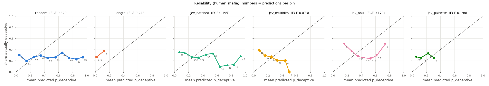

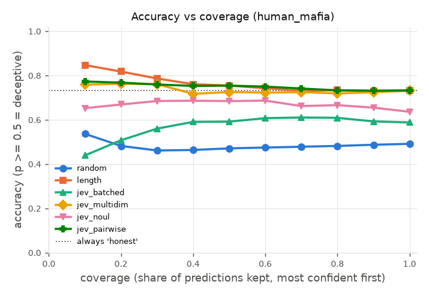

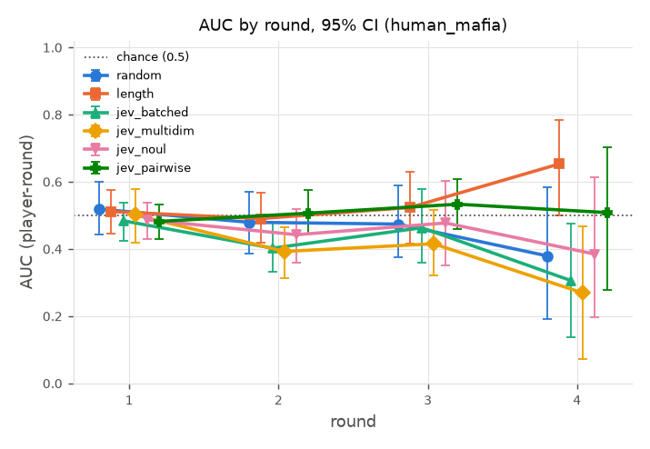

## Source: `llm_mafia`

### Accuracy and calibration

| Judge | Games | AUC player-round | AUC per statement | Round-1 top-1 | R1 chance | Top-1 minus chance | ECE | Brier | Acc @ 50% coverage | Acc @ 100% | Confidence used |
|---|---|---|---|---|---|---|---|---|---|---|---|
| random | 35 | 0.478 [0.438, 0.515] | 0.490 [0.455, 0.521] | 0.257 [0.114, 0.400] | 0.200 [0.200, 0.200] | 0.057 [-0.086, 0.200] | 0.322 [0.299, 0.352] | 0.334 [0.317, 0.352] | 0.506 [0.460, 0.548] | 0.487 [0.454, 0.520] | abs(p-0.5) |
| length | 35 | 0.547 [0.536, 0.559] | 0.538 [0.526, 0.550] | 0.286 [0.143, 0.429] | 0.200 [0.200, 0.200] | 0.086 [-0.057, 0.229] | 0.584 [0.547, 0.622] | 0.560 [0.530, 0.591] | 0.268 [0.248, 0.285] | 0.311 [0.273, 0.353] | abs(p-0.5) |
| jev_batched | 35 | 0.640 [0.607, 0.677] | 0.643 [0.606, 0.684] | 0.143 [0.029, 0.257] | 0.200 [0.200, 0.200] | -0.057 [-0.171, 0.057] | 0.053 [0.042, 0.069] | 0.176 [0.168, 0.182] | 0.738 [0.704, 0.766] | 0.758 [0.746, 0.769] | judge |
| jev_multidim | 35 | 0.532 [0.491, 0.570] | 0.537 [0.498, 0.577] | 0.171 [0.057, 0.286] | 0.200 [0.200, 0.200] | -0.029 [-0.143, 0.086] | 0.060 [0.042, 0.085] | 0.181 [0.175, 0.187] | 0.796 [0.764, 0.824] | 0.766 [0.758, 0.774] | judge |
| jev_noul | 35 | 0.566 [0.527, 0.607] | 0.561 [0.519, 0.607] | 0.043 [0.000, 0.114] | 0.200 [0.200, 0.200] | -0.157 [-0.200, -0.086] | 0.185 [0.178, 0.193] | 0.215 [0.207, 0.221] | 0.756 [0.720, 0.793] | 0.674 [0.647, 0.701] | abs(p-0.5) |
| jev_pairwise | 35 | 0.513 [0.472, 0.556] | 0.506 [0.464, 0.551] | 0.240 [0.160, 0.329] | 0.200 [0.200, 0.200] | 0.040 [-0.040, 0.129] | 0.132 [0.121, 0.150] | 0.198 [0.189, 0.206] | 0.775 [0.746, 0.803] | 0.766 [0.758, 0.774] | abs(p-0.5) |

- Ranked by AUC (player-round): jev_batched > jev_noul > length > jev_multidim > jev_pairwise > random
- Ranked by round-1 top-1: length > random > jev_pairwise > jev_multidim > jev_batched > jev_noul
- Ranked by ECE (lower is better): jev_batched < jev_multidim < jev_pairwise < jev_noul < random < length
- Rankings order point estimates only; see the paired comparisons below for which gaps are real.
- Chance: AUC 0.5; round-1 top-1 = mean over games of n_deceptive / n_scored_players (column R1 chance). Always answering 'honest' scores accuracy 0.766 on these rows.

### Cost and latency (per judge.score call = one round's view)

| Judge | Calls | Mean latency s | Median s | p95 s | Total cost | Cost per game |
|---|---|---|---|---|---|---|
| random | 111 | 0.00 [0.00, 0.00] | 0.00 | 0.00 | $0.0000 | $0.0000 [$0.0000, $0.0000] |
| length | 111 | 0.00 [0.00, 0.00] | 0.00 | 0.00 | $0.0000 | $0.0000 [$0.0000, $0.0000] |
| jev_batched | 111 | 0.35 [0.34, 0.36] | 0.36 | 0.41 | $0.0875 | $0.0025 [$0.0023, $0.0027] |
| jev_multidim | 111 | 0.39 [0.38, 0.40] | 0.39 | 0.46 | $0.1042 | $0.0030 [$0.0028, $0.0032] |
| jev_noul | 111 | 0.34 [0.33, 0.35] | 0.35 | 0.43 | $0.0871 | $0.0025 [$0.0023, $0.0027] |
| jev_pairwise | 111 | 0.39 [0.38, 0.40] | 0.39 | 0.47 | $0.1106 | $0.0032 [$0.0029, $0.0034] |

n/a cost = the judge did not report `meta.cost_usd`.

### AUC by round

| Round | random | length | jev_batched | jev_multidim | jev_noul | jev_pairwise |
|---|---|---|---|---|---|---|
| 1 | 0.482 [0.410, 0.556] (n=35) | 0.503 [0.491, 0.519] (n=35) | 0.560 [0.512, 0.605] (n=35) | 0.480 [0.430, 0.528] (n=35) | 0.441 [0.382, 0.499] (n=35) | 0.491 [0.430, 0.560] (n=35) |
| 2 | 0.504 [0.431, 0.578] (n=35) | 0.501 [0.471, 0.530] (n=35) | 0.672 [0.608, 0.735] (n=35) | 0.612 [0.545, 0.683] (n=35) | 0.553 [0.485, 0.628] (n=35) | 0.489 [0.431, 0.549] (n=35) |
| 3 | 0.452 [0.367, 0.530] (n=32) | 0.469 [0.414, 0.522] (n=32) | 0.642 [0.572, 0.717] (n=32) | 0.545 [0.467, 0.618] (n=32) | 0.604 [0.527, 0.687] (n=32) | 0.554 [0.491, 0.616] (n=32) |
| 4 | 0.337 [0.160, 0.551] (n=9) | 0.481 [0.325, 0.634] (n=9) | 0.784 [0.673, 0.909] (n=9) | 0.593 [0.436, 0.749] (n=9) | 0.704 [0.572, 0.852] (n=9) | 0.599 [0.455, 0.726] (n=9) |

n = games with that round judged. The plot shows rounds with at least 5 games.

### Paired comparisons (X minus Y, same games)

| X | Y | Metric | X - Y | 95% CI | p | Games | Verdict |
|---|---|---|---|---|---|---|---|
| random | length | AUC (player-round) | -0.069 | [-0.111, -0.030] | <0.002 | 35 | length better |
| random | length | Round-1 top-1 | -0.029 | [-0.229, +0.171] | 0.942 | 35 | inconclusive (CI includes 0) |
| random | length | ECE | -0.262 | [-0.305, -0.210] | <0.002 | 35 | random better |
| random | jev_batched | AUC (player-round) | -0.162 | [-0.224, -0.105] | <0.002 | 35 | jev_batched better |
| random | jev_batched | Round-1 top-1 | +0.114 | [-0.029, +0.286] | 0.166 | 35 | inconclusive (CI includes 0) |
| random | jev_batched | ECE | +0.270 | [+0.241, +0.297] | <0.002 | 35 | jev_batched better |
| random | jev_multidim | AUC (player-round) | -0.054 | [-0.106, +0.002] | 0.056 | 35 | inconclusive (CI includes 0) |
| random | jev_multidim | Round-1 top-1 | +0.086 | [-0.057, +0.257] | 0.384 | 35 | inconclusive (CI includes 0) |
| random | jev_multidim | ECE | +0.262 | [+0.226, +0.299] | <0.002 | 35 | jev_multidim better |
| random | jev_noul | AUC (player-round) | -0.088 | [-0.144, -0.035] | <0.002 | 35 | jev_noul better |
| random | jev_noul | Round-1 top-1 | +0.214 | [+0.057, +0.371] | 0.014 | 35 | random better |
| random | jev_noul | ECE | +0.137 | [+0.111, +0.167] | <0.002 | 35 | jev_noul better |
| random | jev_pairwise | AUC (player-round) | -0.035 | [-0.086, +0.013] | 0.146 | 35 | inconclusive (CI includes 0) |
| random | jev_pairwise | Round-1 top-1 | +0.017 | [-0.121, +0.169] | 0.844 | 35 | inconclusive (CI includes 0) |
| random | jev_pairwise | ECE | +0.190 | [+0.162, +0.220] | <0.002 | 35 | jev_pairwise better |
| length | jev_batched | AUC (player-round) | -0.092 | [-0.134, -0.054] | <0.002 | 35 | jev_batched better |
| length | jev_batched | Round-1 top-1 | +0.143 | [-0.029, +0.314] | 0.148 | 35 | inconclusive (CI includes 0) |
| length | jev_batched | ECE | +0.532 | [+0.491, +0.564] | <0.002 | 35 | jev_batched better |
| length | jev_multidim | AUC (player-round) | +0.016 | [-0.029, +0.061] | 0.508 | 35 | inconclusive (CI includes 0) |
| length | jev_multidim | Round-1 top-1 | +0.114 | [-0.086, +0.286] | 0.304 | 35 | inconclusive (CI includes 0) |
| length | jev_multidim | ECE | +0.525 | [+0.476, +0.567] | <0.002 | 35 | jev_multidim better |
| length | jev_noul | AUC (player-round) | -0.019 | [-0.063, +0.024] | 0.342 | 35 | inconclusive (CI includes 0) |
| length | jev_noul | Round-1 top-1 | +0.243 | [+0.100, +0.386] | <0.002 | 35 | length better |
| length | jev_noul | ECE | +0.399 | [+0.362, +0.434] | <0.002 | 35 | jev_noul better |
| length | jev_pairwise | AUC (player-round) | +0.034 | [-0.012, +0.080] | 0.160 | 35 | inconclusive (CI includes 0) |
| length | jev_pairwise | Round-1 top-1 | +0.045 | [-0.117, +0.210] | 0.656 | 35 | inconclusive (CI includes 0) |
| length | jev_pairwise | ECE | +0.452 | [+0.410, +0.491] | <0.002 | 35 | jev_pairwise better |
| jev_batched | jev_multidim | AUC (player-round) | +0.108 | [+0.068, +0.148] | <0.002 | 35 | jev_batched better |
| jev_batched | jev_multidim | Round-1 top-1 | -0.029 | [-0.143, +0.086] | 0.882 | 35 | inconclusive (CI includes 0) |
| jev_batched | jev_multidim | ECE | -0.007 | [-0.035, +0.023] | 0.678 | 35 | inconclusive (CI includes 0) |
| jev_batched | jev_noul | AUC (player-round) | +0.073 | [+0.037, +0.109] | <0.002 | 35 | jev_batched better |
| jev_batched | jev_noul | Round-1 top-1 | +0.100 | [+0.000, +0.229] | 0.052 | 35 | inconclusive (CI includes 0) |
| jev_batched | jev_noul | ECE | -0.133 | [-0.142, -0.118] | <0.002 | 35 | jev_batched better |
| jev_batched | jev_pairwise | AUC (player-round) | +0.126 | [+0.083, +0.174] | <0.002 | 35 | jev_batched better |
| jev_batched | jev_pairwise | Round-1 top-1 | -0.098 | [-0.214, +0.029] | 0.114 | 35 | inconclusive (CI includes 0) |
| jev_batched | jev_pairwise | ECE | -0.080 | [-0.103, -0.056] | <0.002 | 35 | jev_batched better |
| jev_multidim | jev_noul | AUC (player-round) | -0.034 | [-0.068, -0.000] | 0.046 | 35 | jev_noul better |
| jev_multidim | jev_noul | Round-1 top-1 | +0.129 | [+0.000, +0.271] | 0.088 | 35 | inconclusive (CI includes 0) |
| jev_multidim | jev_noul | ECE | -0.126 | [-0.147, -0.099] | <0.002 | 35 | jev_multidim better |
| jev_multidim | jev_pairwise | AUC (player-round) | +0.019 | [-0.027, +0.061] | 0.380 | 35 | inconclusive (CI includes 0) |
| jev_multidim | jev_pairwise | Round-1 top-1 | -0.069 | [-0.198, +0.074] | 0.276 | 35 | inconclusive (CI includes 0) |
| jev_multidim | jev_pairwise | ECE | -0.072 | [-0.095, -0.048] | <0.002 | 35 | jev_multidim better |
| jev_noul | jev_pairwise | AUC (player-round) | +0.053 | [+0.014, +0.095] | 0.006 | 35 | jev_noul better |
| jev_noul | jev_pairwise | Round-1 top-1 | -0.198 | [-0.295, -0.098] | <0.002 | 35 | jev_pairwise better |
| jev_noul | jev_pairwise | ECE | +0.053 | [+0.031, +0.068] | <0.002 | 35 | jev_pairwise better |

p = two-sided paired-bootstrap p-value (its resolution is limited by the number of replicates). For ECE, lower is better, so a negative X - Y favors X.

### Plots

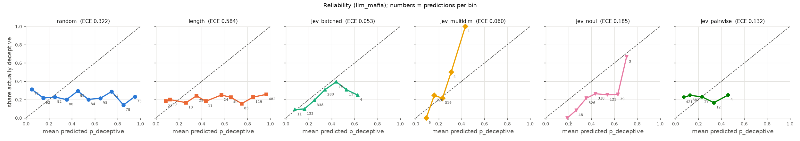

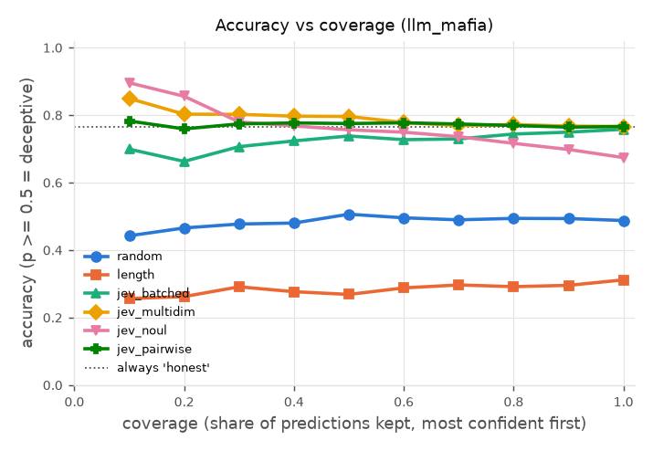

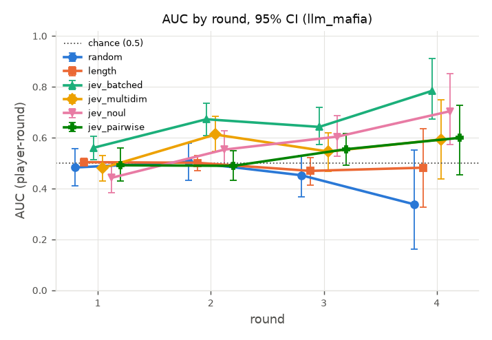

## Source: `avalon`

### Accuracy and calibration

| Judge | Games | AUC player-round | AUC per statement | Round-1 top-1 | R1 chance | Top-1 minus chance | ECE | Brier | Acc @ 50% coverage | Acc @ 100% | Confidence used |
|---|---|---|---|---|---|---|---|---|---|---|---|
| random | 20 | 0.533 [0.474, 0.587] | 0.550 [0.484, 0.615] | 0.200 [0.050, 0.400] | 0.326 [0.306, 0.340] | -0.126 [-0.277, 0.063] | 0.279 [0.251, 0.326] | 0.328 [0.302, 0.356] | 0.521 [0.457, 0.579] | 0.511 [0.456, 0.563] | abs(p-0.5) |
| length | 20 | 0.488 [0.459, 0.516] | 0.484 [0.417, 0.530] | 0.350 [0.150, 0.550] | 0.326 [0.306, 0.340] | 0.024 [-0.164, 0.230] | 0.230 [0.211, 0.258] | 0.282 [0.274, 0.290] | 0.661 [0.631, 0.698] | 0.652 [0.634, 0.669] | abs(p-0.5) |
| jev_batched | 20 | 0.506 [0.447, 0.569] | 0.480 [0.389, 0.588] | 0.175 [0.025, 0.350] | 0.326 [0.306, 0.340] | -0.151 [-0.291, 0.019] | 0.188 [0.140, 0.233] | 0.283 [0.254, 0.309] | 0.570 [0.515, 0.637] | 0.578 [0.535, 0.624] | judge |
| jev_multidim | 20 | 0.517 [0.442, 0.589] | 0.495 [0.389, 0.613] | 0.350 [0.150, 0.551] | 0.326 [0.306, 0.340] | 0.024 [-0.173, 0.231] | 0.135 [0.124, 0.155] | 0.241 [0.233, 0.249] | 0.694 [0.667, 0.726] | 0.671 [0.663, 0.678] | judge |
| jev_noul | 20 | 0.608 [0.548, 0.666] | 0.603 [0.512, 0.705] | 0.350 [0.150, 0.550] | 0.326 [0.306, 0.340] | 0.024 [-0.174, 0.220] | 0.077 [0.062, 0.102] | 0.218 [0.206, 0.230] | 0.707 [0.656, 0.761] | 0.660 [0.618, 0.701] | abs(p-0.5) |
| jev_pairwise | 20 | 0.385 [0.325, 0.442] | 0.348 [0.236, 0.446] | 0.292 [0.179, 0.412] | 0.326 [0.306, 0.340] | -0.034 [-0.147, 0.088] | 0.304 [0.254, 0.362] | 0.326 [0.295, 0.356] | 0.563 [0.516, 0.610] | 0.522 [0.467, 0.578] | abs(p-0.5) |

- Ranked by AUC (player-round): jev_noul > random > jev_multidim > jev_batched > length > jev_pairwise
- Ranked by round-1 top-1: length = jev_multidim = jev_noul > jev_pairwise > random > jev_batched
- Ranked by ECE (lower is better): jev_noul < jev_multidim < jev_batched < length < random < jev_pairwise
- Rankings order point estimates only; see the paired comparisons below for which gaps are real.
- Chance: AUC 0.5; round-1 top-1 = mean over games of n_deceptive / n_scored_players (column R1 chance). Always answering 'honest' scores accuracy 0.671 on these rows.

### Cost and latency (per judge.score call = one round's view)

| Judge | Calls | Mean latency s | Median s | p95 s | Total cost | Cost per game |
|---|---|---|---|---|---|---|
| random | 82 | 0.00 [0.00, 0.00] | 0.00 | 0.00 | $0.0000 | $0.0000 [$0.0000, $0.0000] |
| length | 82 | 0.00 [0.00, 0.00] | 0.00 | 0.00 | $0.0000 | $0.0000 [$0.0000, $0.0000] |
| jev_batched | 82 | 0.20 [0.19, 0.21] | 0.19 | 0.25 | $0.0122 | $0.0006 [$0.0005, $0.0007] |
| jev_multidim | 82 | 0.23 [0.22, 0.24] | 0.22 | 0.31 | $0.0218 | $0.0011 [$0.0009, $0.0012] |
| jev_noul | 82 | 0.21 [0.20, 0.22] | 0.20 | 0.28 | $0.0120 | $0.0006 [$0.0005, $0.0007] |
| jev_pairwise | 82 | 0.22 [0.21, 0.23] | 0.21 | 0.32 | $0.0226 | $0.0011 [$0.0010, $0.0013] |

n/a cost = the judge did not report `meta.cost_usd`.

### AUC by round

| Round | random | length | jev_batched | jev_multidim | jev_noul | jev_pairwise |
|---|---|---|---|---|---|---|
| 1 | 0.382 [0.263, 0.486] (n=20) | 0.509 [0.427, 0.588] (n=20) | 0.427 [0.326, 0.532] (n=20) | 0.514 [0.424, 0.604] (n=20) | 0.499 [0.450, 0.554] (n=20) | 0.496 [0.398, 0.601] (n=20) |
| 2 | 0.553 [0.454, 0.648] (n=20) | 0.500 [0.428, 0.569] (n=20) | 0.443 [0.370, 0.518] (n=20) | 0.467 [0.360, 0.579] (n=20) | 0.493 [0.426, 0.561] (n=20) | 0.387 [0.301, 0.468] (n=20) |
| 3 | 0.540 [0.425, 0.656] (n=20) | 0.455 [0.380, 0.521] (n=20) | 0.547 [0.431, 0.653] (n=20) | 0.516 [0.392, 0.631] (n=20) | 0.700 [0.571, 0.808] (n=20) | 0.272 [0.172, 0.386] (n=20) |
| 4 | 0.698 [0.612, 0.790] (n=16) | 0.470 [0.385, 0.542] (n=16) | 0.584 [0.470, 0.706] (n=16) | 0.595 [0.466, 0.715] (n=16) | 0.730 [0.606, 0.845] (n=16) | 0.274 [0.167, 0.391] (n=16) |
| 5 | 0.519 [0.250, 0.694] (n=6) | 0.572 [0.493, 0.704] (n=6) | 0.462 [0.199, 0.693] (n=6) | 0.453 [0.216, 0.608] (n=6) | 0.684 [0.430, 0.850] (n=6) | 0.235 [0.036, 0.487] (n=6) |

n = games with that round judged. The plot shows rounds with at least 5 games.

### Paired comparisons (X minus Y, same games)

| X | Y | Metric | X - Y | 95% CI | p | Games | Verdict |
|---|---|---|---|---|---|---|---|
| random | length | AUC (player-round) | +0.045 | [-0.008, +0.097] | 0.098 | 20 | inconclusive (CI includes 0) |
| random | length | Round-1 top-1 | -0.150 | [-0.400, +0.100] | 0.336 | 20 | inconclusive (CI includes 0) |
| random | length | ECE | +0.049 | [+0.010, +0.096] | 0.010 | 20 | length better |
| random | jev_batched | AUC (player-round) | +0.027 | [-0.036, +0.095] | 0.448 | 20 | inconclusive (CI includes 0) |
| random | jev_batched | Round-1 top-1 | +0.025 | [-0.150, +0.225] | 0.860 | 20 | inconclusive (CI includes 0) |
| random | jev_batched | ECE | +0.091 | [+0.056, +0.147] | <0.002 | 20 | jev_batched better |
| random | jev_multidim | AUC (player-round) | +0.016 | [-0.078, +0.112] | 0.756 | 20 | inconclusive (CI includes 0) |
| random | jev_multidim | Round-1 top-1 | -0.150 | [-0.400, +0.100] | 0.370 | 20 | inconclusive (CI includes 0) |
| random | jev_multidim | ECE | +0.144 | [+0.110, +0.192] | <0.002 | 20 | jev_multidim better |
| random | jev_noul | AUC (player-round) | -0.075 | [-0.138, -0.012] | 0.016 | 20 | jev_noul better |
| random | jev_noul | Round-1 top-1 | -0.150 | [-0.400, +0.150] | 0.356 | 20 | inconclusive (CI includes 0) |
| random | jev_noul | ECE | +0.203 | [+0.170, +0.245] | <0.002 | 20 | jev_noul better |
| random | jev_pairwise | AUC (player-round) | +0.148 | [+0.061, +0.235] | 0.002 | 20 | random better |
| random | jev_pairwise | Round-1 top-1 | -0.092 | [-0.300, +0.125] | 0.478 | 20 | inconclusive (CI includes 0) |
| random | jev_pairwise | ECE | -0.025 | [-0.093, +0.059] | 0.604 | 20 | inconclusive (CI includes 0) |
| length | jev_batched | AUC (player-round) | -0.018 | [-0.094, +0.055] | 0.688 | 20 | inconclusive (CI includes 0) |
| length | jev_batched | Round-1 top-1 | +0.175 | [-0.050, +0.400] | 0.190 | 20 | inconclusive (CI includes 0) |
| length | jev_batched | ECE | +0.042 | [-0.012, +0.100] | 0.116 | 20 | inconclusive (CI includes 0) |
| length | jev_multidim | AUC (player-round) | -0.028 | [-0.119, +0.062] | 0.560 | 20 | inconclusive (CI includes 0) |
| length | jev_multidim | Round-1 top-1 | +0.000 | [-0.250, +0.300] | 1.000 | 20 | inconclusive (CI includes 0) |
| length | jev_multidim | ECE | +0.095 | [+0.074, +0.118] | <0.002 | 20 | jev_multidim better |
| length | jev_noul | AUC (player-round) | -0.120 | [-0.191, -0.050] | <0.002 | 20 | jev_noul better |
| length | jev_noul | Round-1 top-1 | +0.000 | [-0.217, +0.233] | 1.000 | 20 | inconclusive (CI includes 0) |
| length | jev_noul | ECE | +0.154 | [+0.123, +0.185] | <0.002 | 20 | jev_noul better |
| length | jev_pairwise | AUC (player-round) | +0.103 | [+0.043, +0.166] | 0.004 | 20 | length better |
| length | jev_pairwise | Round-1 top-1 | +0.058 | [-0.192, +0.329] | 0.664 | 20 | inconclusive (CI includes 0) |
| length | jev_pairwise | ECE | -0.074 | [-0.133, -0.021] | 0.010 | 20 | length better |
| jev_batched | jev_multidim | AUC (player-round) | -0.011 | [-0.067, +0.050] | 0.686 | 20 | inconclusive (CI includes 0) |
| jev_batched | jev_multidim | Round-1 top-1 | -0.175 | [-0.375, +0.000] | 0.078 | 20 | inconclusive (CI includes 0) |
| jev_batched | jev_multidim | ECE | +0.053 | [+0.001, +0.100] | 0.048 | 20 | jev_multidim better |
| jev_batched | jev_noul | AUC (player-round) | -0.102 | [-0.142, -0.063] | <0.002 | 20 | jev_noul better |
| jev_batched | jev_noul | Round-1 top-1 | -0.175 | [-0.400, +0.067] | 0.154 | 20 | inconclusive (CI includes 0) |
| jev_batched | jev_noul | ECE | +0.112 | [+0.059, +0.150] | <0.002 | 20 | jev_noul better |
| jev_batched | jev_pairwise | AUC (player-round) | +0.121 | [+0.015, +0.232] | 0.018 | 20 | jev_batched better |
| jev_batched | jev_pairwise | Round-1 top-1 | -0.117 | [-0.292, +0.096] | 0.274 | 20 | inconclusive (CI includes 0) |
| jev_batched | jev_pairwise | ECE | -0.116 | [-0.205, -0.034] | 0.006 | 20 | jev_batched better |
| jev_multidim | jev_noul | AUC (player-round) | -0.091 | [-0.172, -0.028] | 0.008 | 20 | jev_noul better |
| jev_multidim | jev_noul | Round-1 top-1 | +0.000 | [-0.234, +0.233] | 1.000 | 20 | inconclusive (CI includes 0) |
| jev_multidim | jev_noul | ECE | +0.058 | [+0.030, +0.084] | <0.002 | 20 | jev_noul better |
| jev_multidim | jev_pairwise | AUC (player-round) | +0.132 | [+0.018, +0.244] | 0.014 | 20 | jev_multidim better |
| jev_multidim | jev_pairwise | Round-1 top-1 | +0.058 | [-0.167, +0.304] | 0.640 | 20 | inconclusive (CI includes 0) |
| jev_multidim | jev_pairwise | ECE | -0.169 | [-0.220, -0.119] | <0.002 | 20 | jev_multidim better |
| jev_noul | jev_pairwise | AUC (player-round) | +0.223 | [+0.118, +0.325] | <0.002 | 20 | jev_noul better |
| jev_noul | jev_pairwise | Round-1 top-1 | +0.058 | [-0.167, +0.271] | 0.634 | 20 | inconclusive (CI includes 0) |
| jev_noul | jev_pairwise | ECE | -0.228 | [-0.282, -0.168] | <0.002 | 20 | jev_noul better |

p = two-sided paired-bootstrap p-value (its resolution is limited by the number of replicates). For ECE, lower is better, so a negative X - Y favors X.

### Plots

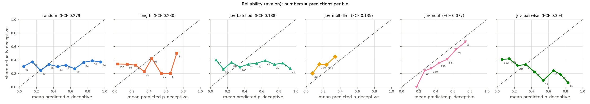

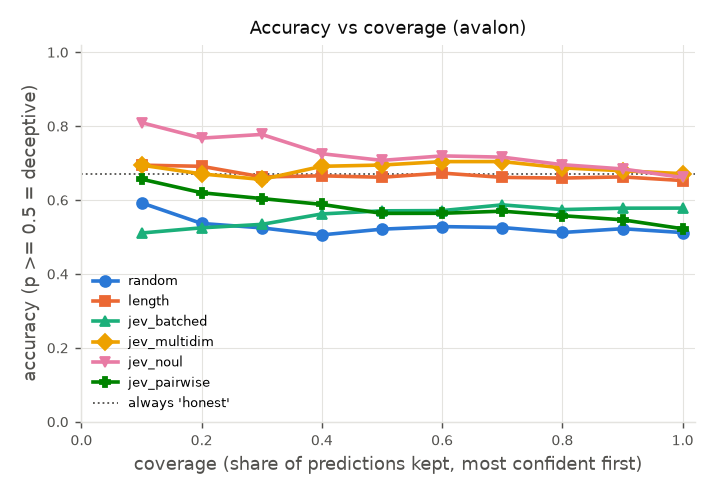

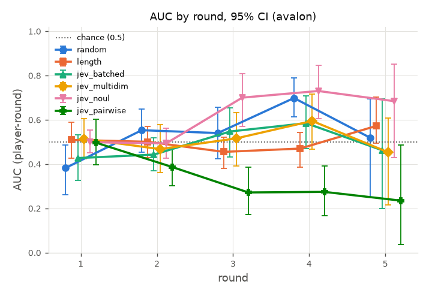

## Source: `werewolf_among_us`

### Accuracy and calibration

| Judge | Games | AUC player-round | AUC per statement | Round-1 top-1 | R1 chance | Top-1 minus chance | ECE | Brier | Acc @ 50% coverage | Acc @ 100% | Confidence used |
|---|---|---|---|---|---|---|---|---|---|---|---|
| random | 191 | 0.510 [0.465, 0.556] | 0.512 [0.461, 0.562] | 0.304 [0.236, 0.366] | 0.290 [0.267, 0.312] | 0.014 [-0.051, 0.075] | 0.301 [0.269, 0.331] | 0.329 [0.309, 0.349] | 0.503 [0.457, 0.553] | 0.496 [0.464, 0.528] | abs(p-0.5) |
| length | 191 | 0.461 [0.423, 0.499] | 0.463 [0.417, 0.509] | 0.225 [0.168, 0.283] | 0.290 [0.267, 0.312] | -0.065 [-0.118, -0.010] | 0.133 [0.115, 0.163] | 0.231 [0.216, 0.246] | 0.687 [0.649, 0.725] | 0.708 [0.688, 0.730] | abs(p-0.5) |
| jev_batched | 191 | 0.510 [0.476, 0.550] | 0.500 [0.461, 0.542] | 0.257 [0.199, 0.317] | 0.290 [0.267, 0.312] | -0.033 [-0.089, 0.025] | 0.407 [0.382, 0.436] | 0.413 [0.392, 0.434] | 0.353 [0.312, 0.398] | 0.424 [0.396, 0.454] | judge |
| jev_multidim | 191 | 0.524 [0.488, 0.563] | 0.525 [0.484, 0.564] | 0.325 [0.262, 0.393] | 0.290 [0.267, 0.312] | 0.035 [-0.019, 0.096] | 0.070 [0.046, 0.099] | 0.210 [0.199, 0.222] | 0.715 [0.684, 0.754] | 0.712 [0.692, 0.734] | judge |
| jev_noul | 191 | 0.547 [0.511, 0.584] | 0.542 [0.503, 0.581] | 0.277 [0.217, 0.340] | 0.290 [0.267, 0.312] | -0.012 [-0.073, 0.050] | 0.226 [0.205, 0.248] | 0.266 [0.257, 0.276] | 0.509 [0.460, 0.553] | 0.503 [0.471, 0.533] | abs(p-0.5) |
| jev_pairwise | 191 | 0.466 [0.426, 0.505] | 0.446 [0.401, 0.488] | 0.261 [0.222, 0.301] | 0.290 [0.267, 0.312] | -0.029 [-0.063, 0.006] | 0.116 [0.088, 0.147] | 0.226 [0.213, 0.240] | 0.700 [0.659, 0.735] | 0.685 [0.659, 0.712] | abs(p-0.5) |

- Ranked by AUC (player-round): jev_noul > jev_multidim > random = jev_batched > jev_pairwise > length
- Ranked by round-1 top-1: jev_multidim > random > jev_noul > jev_pairwise > jev_batched > length
- Ranked by ECE (lower is better): jev_multidim < jev_pairwise < length < jev_noul < random < jev_batched
- Rankings order point estimates only; see the paired comparisons below for which gaps are real.
- Chance: AUC 0.5; round-1 top-1 = mean over games of n_deceptive / n_scored_players (column R1 chance). Always answering 'honest' scores accuracy 0.712 on these rows.

### Cost and latency (per judge.score call = one round's view)

| Judge | Calls | Mean latency s | Median s | p95 s | Total cost | Cost per game |
|---|---|---|---|---|---|---|
| random | 191 | 0.00 [0.00, 0.00] | 0.00 | 0.00 | $0.0000 | $0.0000 [$0.0000, $0.0000] |
| length | 191 | 0.00 [0.00, 0.00] | 0.00 | 0.00 | $0.0000 | $0.0000 [$0.0000, $0.0000] |
| jev_batched | 191 | 0.20 [0.20, 0.21] | 0.20 | 0.25 | $0.0347 | $0.0002 [$0.0002, $0.0002] |
| jev_multidim | 191 | 0.22 [0.22, 0.23] | 0.21 | 0.28 | $0.0514 | $0.0003 [$0.0003, $0.0003] |
| jev_noul | 191 | 0.20 [0.19, 0.20] | 0.19 | 0.26 | $0.0342 | $0.0002 [$0.0002, $0.0002] |
| jev_pairwise | 191 | 0.20 [0.20, 0.21] | 0.20 | 0.26 | $0.0447 | $0.0002 [$0.0002, $0.0002] |

n/a cost = the judge did not report `meta.cost_usd`.

### AUC by round

| Round | random | length | jev_batched | jev_multidim | jev_noul | jev_pairwise |
|---|---|---|---|---|---|---|
| 1 | 0.510 [0.465, 0.556] (n=191) | 0.461 [0.423, 0.499] (n=191) | 0.510 [0.476, 0.550] (n=191) | 0.524 [0.488, 0.563] (n=191) | 0.547 [0.511, 0.584] (n=191) | 0.466 [0.426, 0.505] (n=191) |

n = games with that round judged. The plot shows rounds with at least 5 games.

### Paired comparisons (X minus Y, same games)

| X | Y | Metric | X - Y | 95% CI | p | Games | Verdict |
|---|---|---|---|---|---|---|---|
| random | length | AUC (player-round) | +0.049 | [-0.013, +0.112] | 0.120 | 191 | inconclusive (CI includes 0) |
| random | length | Round-1 top-1 | +0.079 | [-0.005, +0.162] | 0.072 | 191 | inconclusive (CI includes 0) |
| random | length | ECE | +0.168 | [+0.120, +0.205] | <0.002 | 191 | length better |
| random | jev_batched | AUC (player-round) | +0.001 | [-0.058, +0.057] | 0.994 | 191 | inconclusive (CI includes 0) |
| random | jev_batched | Round-1 top-1 | +0.047 | [-0.042, +0.136] | 0.312 | 191 | inconclusive (CI includes 0) |
| random | jev_batched | ECE | -0.106 | [-0.149, -0.070] | <0.002 | 191 | random better |
| random | jev_multidim | AUC (player-round) | -0.014 | [-0.073, +0.044] | 0.630 | 191 | inconclusive (CI includes 0) |
| random | jev_multidim | Round-1 top-1 | -0.021 | [-0.115, +0.063] | 0.686 | 191 | inconclusive (CI includes 0) |
| random | jev_multidim | ECE | +0.231 | [+0.188, +0.271] | <0.002 | 191 | jev_multidim better |
| random | jev_noul | AUC (player-round) | -0.036 | [-0.092, +0.018] | 0.192 | 191 | inconclusive (CI includes 0) |
| random | jev_noul | Round-1 top-1 | +0.026 | [-0.058, +0.115] | 0.626 | 191 | inconclusive (CI includes 0) |
| random | jev_noul | ECE | +0.075 | [+0.039, +0.108] | <0.002 | 191 | jev_noul better |
| random | jev_pairwise | AUC (player-round) | +0.045 | [-0.014, +0.104] | 0.144 | 191 | inconclusive (CI includes 0) |
| random | jev_pairwise | Round-1 top-1 | +0.043 | [-0.028, +0.113] | 0.258 | 191 | inconclusive (CI includes 0) |
| random | jev_pairwise | ECE | +0.184 | [+0.140, +0.227] | <0.002 | 191 | jev_pairwise better |
| length | jev_batched | AUC (player-round) | -0.048 | [-0.093, -0.008] | 0.020 | 191 | jev_batched better |
| length | jev_batched | Round-1 top-1 | -0.031 | [-0.102, +0.042] | 0.394 | 191 | inconclusive (CI includes 0) |
| length | jev_batched | ECE | -0.275 | [-0.307, -0.231] | <0.002 | 191 | length better |
| length | jev_multidim | AUC (player-round) | -0.063 | [-0.112, -0.013] | 0.012 | 191 | jev_multidim better |
| length | jev_multidim | Round-1 top-1 | -0.099 | [-0.183, -0.016] | 0.020 | 191 | jev_multidim better |
| length | jev_multidim | ECE | +0.063 | [+0.039, +0.096] | <0.002 | 191 | jev_multidim better |
| length | jev_noul | AUC (player-round) | -0.085 | [-0.135, -0.041] | <0.002 | 191 | jev_noul better |
| length | jev_noul | Round-1 top-1 | -0.052 | [-0.131, +0.029] | 0.226 | 191 | inconclusive (CI includes 0) |
| length | jev_noul | ECE | -0.094 | [-0.127, -0.048] | <0.002 | 191 | length better |
| length | jev_pairwise | AUC (player-round) | -0.004 | [-0.056, +0.045] | 0.890 | 191 | inconclusive (CI includes 0) |
| length | jev_pairwise | Round-1 top-1 | -0.036 | [-0.095, +0.033] | 0.292 | 191 | inconclusive (CI includes 0) |
| length | jev_pairwise | ECE | +0.016 | [-0.010, +0.055] | 0.196 | 191 | inconclusive (CI includes 0) |
| jev_batched | jev_multidim | AUC (player-round) | -0.015 | [-0.043, +0.013] | 0.400 | 191 | inconclusive (CI includes 0) |
| jev_batched | jev_multidim | Round-1 top-1 | -0.068 | [-0.126, -0.010] | 0.026 | 191 | jev_multidim better |
| jev_batched | jev_multidim | ECE | +0.337 | [+0.296, +0.378] | <0.002 | 191 | jev_multidim better |
| jev_batched | jev_noul | AUC (player-round) | -0.037 | [-0.062, -0.012] | 0.006 | 191 | jev_noul better |
| jev_batched | jev_noul | Round-1 top-1 | -0.021 | [-0.084, +0.042] | 0.518 | 191 | inconclusive (CI includes 0) |
| jev_batched | jev_noul | ECE | +0.181 | [+0.164, +0.201] | <0.002 | 191 | jev_noul better |
| jev_batched | jev_pairwise | AUC (player-round) | +0.044 | [-0.009, +0.101] | 0.122 | 191 | inconclusive (CI includes 0) |
| jev_batched | jev_pairwise | Round-1 top-1 | -0.004 | [-0.071, +0.064] | 0.950 | 191 | inconclusive (CI includes 0) |
| jev_batched | jev_pairwise | ECE | +0.291 | [+0.248, +0.334] | <0.002 | 191 | jev_pairwise better |
| jev_multidim | jev_noul | AUC (player-round) | -0.022 | [-0.054, +0.008] | 0.154 | 191 | inconclusive (CI includes 0) |
| jev_multidim | jev_noul | Round-1 top-1 | +0.047 | [-0.013, +0.115] | 0.168 | 191 | inconclusive (CI includes 0) |
| jev_multidim | jev_noul | ECE | -0.156 | [-0.197, -0.114] | <0.002 | 191 | jev_multidim better |
| jev_multidim | jev_pairwise | AUC (player-round) | +0.059 | [-0.002, +0.118] | 0.060 | 191 | inconclusive (CI includes 0) |
| jev_multidim | jev_pairwise | Round-1 top-1 | +0.064 | [-0.006, +0.134] | 0.058 | 191 | inconclusive (CI includes 0) |
| jev_multidim | jev_pairwise | ECE | -0.046 | [-0.079, -0.011] | 0.016 | 191 | jev_multidim better |
| jev_noul | jev_pairwise | AUC (player-round) | +0.081 | [+0.027, +0.138] | 0.006 | 191 | jev_noul better |
| jev_noul | jev_pairwise | Round-1 top-1 | +0.017 | [-0.057, +0.093] | 0.664 | 191 | inconclusive (CI includes 0) |
| jev_noul | jev_pairwise | ECE | +0.110 | [+0.067, +0.152] | <0.002 | 191 | jev_pairwise better |

p = two-sided paired-bootstrap p-value (its resolution is limited by the number of replicates). For ECE, lower is better, so a negative X - Y favors X.

### Plots

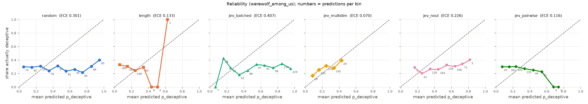

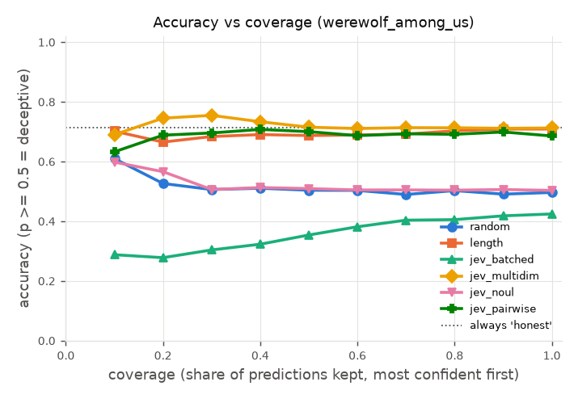

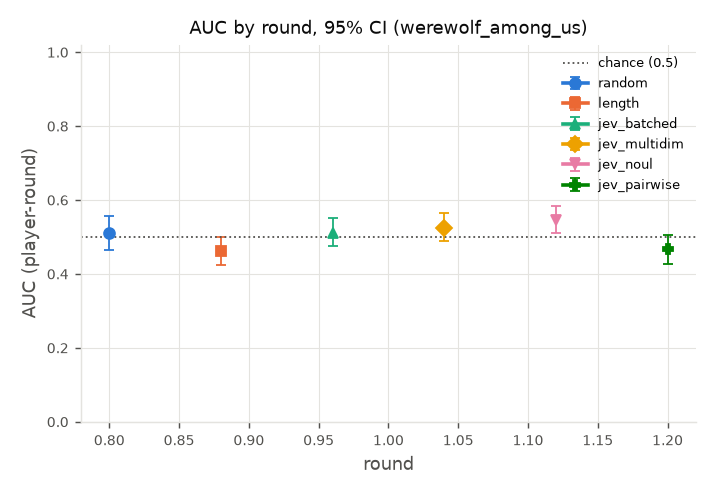

## All sources pooled

### Accuracy and calibration

| Judge | Games | AUC player-round | AUC per statement | Round-1 top-1 | R1 chance | Top-1 minus chance | ECE | Brier | Acc @ 50% coverage | Acc @ 100% | Confidence used |
|---|---|---|---|---|---|---|---|---|---|---|---|
| random | 290 | 0.503 [0.479, 0.525] | 0.510 [0.477, 0.544] | 0.293 [0.238, 0.345] | 0.273 [0.258, 0.288] | 0.020 [-0.030, 0.068] | 0.306 [0.291, 0.324] | 0.335 [0.325, 0.346] | 0.500 [0.475, 0.526] | 0.495 [0.477, 0.512] | abs(p-0.5) |
| length | 290 | 0.478 [0.467, 0.492] | 0.465 [0.442, 0.486] | 0.233 [0.183, 0.281] | 0.273 [0.258, 0.288] | -0.041 [-0.088, 0.008] | 0.309 [0.275, 0.340] | 0.344 [0.317, 0.368] | 0.581 [0.540, 0.626] | 0.587 [0.556, 0.624] | abs(p-0.5) |
| jev_batched | 290 | 0.532 [0.508, 0.555] | 0.531 [0.502, 0.557] | 0.229 [0.181, 0.278] | 0.273 [0.258, 0.288] | -0.044 [-0.088, 0.002] | 0.199 [0.179, 0.226] | 0.287 [0.273, 0.303] | 0.565 [0.531, 0.592] | 0.588 [0.561, 0.611] | judge |
| jev_multidim | 290 | 0.512 [0.485, 0.535] | 0.531 [0.502, 0.560] | 0.310 [0.262, 0.362] | 0.273 [0.258, 0.288] | 0.037 [-0.007, 0.086] | 0.072 [0.059, 0.085] | 0.206 [0.200, 0.212] | 0.740 [0.723, 0.757] | 0.726 [0.716, 0.736] | judge |
| jev_noul | 290 | 0.545 [0.519, 0.568] | 0.552 [0.525, 0.582] | 0.241 [0.197, 0.293] | 0.273 [0.258, 0.288] | -0.032 [-0.075, 0.017] | 0.172 [0.162, 0.185] | 0.234 [0.229, 0.240] | 0.657 [0.628, 0.684] | 0.612 [0.592, 0.631] | abs(p-0.5) |
| jev_pairwise | 290 | 0.493 [0.470, 0.516] | 0.483 [0.453, 0.511] | 0.241 [0.208, 0.273] | 0.273 [0.258, 0.288] | -0.033 [-0.063, -0.003] | 0.172 [0.156, 0.188] | 0.237 [0.227, 0.247] | 0.728 [0.708, 0.746] | 0.693 [0.674, 0.712] | abs(p-0.5) |

- Ranked by AUC (player-round): jev_noul > jev_batched > jev_multidim > random > jev_pairwise > length
- Ranked by round-1 top-1: jev_multidim > random > jev_noul = jev_pairwise > length > jev_batched
- Ranked by ECE (lower is better): jev_multidim < jev_pairwise = jev_noul < jev_batched < random < length
- Rankings order point estimates only; see the paired comparisons below for which gaps are real.
- Chance: AUC 0.5; round-1 top-1 = mean over games of n_deceptive / n_scored_players (column R1 chance). Always answering 'honest' scores accuracy 0.726 on these rows.

### Cost and latency (per judge.score call = one round's view)

| Judge | Calls | Mean latency s | Median s | p95 s | Total cost | Cost per game |
|---|---|---|---|---|---|---|
| random | 509 | 0.00 [0.00, 0.00] | 0.00 | 0.00 | $0.0000 | $0.0000 [$0.0000, $0.0000] |
| length | 509 | 0.00 [0.00, 0.00] | 0.00 | 0.00 | $0.0000 | $0.0000 [$0.0000, $0.0000] |
| jev_batched | 509 | 0.23 [0.22, 0.24] | 0.20 | 0.37 | $0.1436 | $0.0005 [$0.0004, $0.0006] |
| jev_multidim | 509 | 0.26 [0.25, 0.27] | 0.22 | 0.42 | $0.2001 | $0.0007 [$0.0006, $0.0008] |
| jev_noul | 509 | 0.23 [0.22, 0.24] | 0.20 | 0.38 | $0.1421 | $0.0005 [$0.0004, $0.0006] |
| jev_pairwise | 509 | 0.25 [0.24, 0.26] | 0.21 | 0.43 | $0.2024 | $0.0007 [$0.0006, $0.0008] |

n/a cost = the judge did not report `meta.cost_usd`.

### AUC by round

| Round | random | length | jev_batched | jev_multidim | jev_noul | jev_pairwise |
|---|---|---|---|---|---|---|
| 1 | 0.498 [0.465, 0.530] (n=290) | 0.473 [0.457, 0.491] (n=290) | 0.533 [0.510, 0.555] (n=290) | 0.528 [0.501, 0.555] (n=290) | 0.533 [0.509, 0.555] (n=290) | 0.508 [0.484, 0.529] (n=290) |
| 2 | 0.507 [0.458, 0.557] (n=96) | 0.464 [0.442, 0.486] (n=96) | 0.519 [0.467, 0.566] (n=96) | 0.510 [0.460, 0.559] (n=96) | 0.498 [0.452, 0.541] (n=96) | 0.471 [0.436, 0.513] (n=96) |
| 3 | 0.488 [0.432, 0.548] (n=82) | 0.467 [0.437, 0.494] (n=82) | 0.558 [0.498, 0.617] (n=82) | 0.502 [0.448, 0.553] (n=82) | 0.600 [0.539, 0.658] (n=82) | 0.482 [0.432, 0.534] (n=82) |
| 4 | 0.558 [0.455, 0.656] (n=34) | 0.456 [0.418, 0.500] (n=34) | 0.567 [0.478, 0.654] (n=34) | 0.538 [0.442, 0.629] (n=34) | 0.660 [0.556, 0.754] (n=34) | 0.417 [0.332, 0.497] (n=34) |
| 5 | 0.556 [0.346, 0.741] (n=7) | 0.524 [0.386, 0.646] (n=7) | 0.431 [0.174, 0.651] (n=7) | 0.467 [0.254, 0.635] (n=7) | 0.660 [0.404, 0.831] (n=7) | 0.215 [0.024, 0.446] (n=7) |

n = games with that round judged. The plot shows rounds with at least 5 games.

### Paired comparisons (X minus Y, same games)

| X | Y | Metric | X - Y | 95% CI | p | Games | Verdict |
|---|---|---|---|---|---|---|---|
| random | length | AUC (player-round) | +0.025 | [-0.003, +0.050] | 0.070 | 290 | inconclusive (CI includes 0) |
| random | length | Round-1 top-1 | +0.060 | [-0.007, +0.128] | 0.090 | 290 | inconclusive (CI includes 0) |
| random | length | ECE | -0.003 | [-0.035, +0.037] | 1.000 | 290 | inconclusive (CI includes 0) |
| random | jev_batched | AUC (player-round) | -0.029 | [-0.063, +0.007] | 0.096 | 290 | inconclusive (CI includes 0) |
| random | jev_batched | Round-1 top-1 | +0.064 | [-0.002, +0.128] | 0.058 | 290 | inconclusive (CI includes 0) |
| random | jev_batched | ECE | +0.108 | [+0.077, +0.136] | <0.002 | 290 | jev_batched better |
| random | jev_multidim | AUC (player-round) | -0.008 | [-0.044, +0.030] | 0.654 | 290 | inconclusive (CI includes 0) |
| random | jev_multidim | Round-1 top-1 | -0.017 | [-0.086, +0.055] | 0.668 | 290 | inconclusive (CI includes 0) |
| random | jev_multidim | ECE | +0.235 | [+0.213, +0.258] | <0.002 | 290 | jev_multidim better |
| random | jev_noul | AUC (player-round) | -0.042 | [-0.074, -0.008] | 0.020 | 290 | jev_noul better |
| random | jev_noul | Round-1 top-1 | +0.052 | [-0.023, +0.120] | 0.186 | 290 | inconclusive (CI includes 0) |
| random | jev_noul | ECE | +0.134 | [+0.117, +0.154] | <0.002 | 290 | jev_noul better |
| random | jev_pairwise | AUC (player-round) | +0.010 | [-0.021, +0.042] | 0.554 | 290 | inconclusive (CI includes 0) |
| random | jev_pairwise | Round-1 top-1 | +0.052 | [-0.001, +0.107] | 0.070 | 290 | inconclusive (CI includes 0) |
| random | jev_pairwise | ECE | +0.135 | [+0.111, +0.162] | <0.002 | 290 | jev_pairwise better |
| length | jev_batched | AUC (player-round) | -0.054 | [-0.079, -0.024] | <0.002 | 290 | jev_batched better |
| length | jev_batched | Round-1 top-1 | +0.003 | [-0.050, +0.057] | 0.926 | 290 | inconclusive (CI includes 0) |
| length | jev_batched | ECE | +0.110 | [+0.054, +0.158] | <0.002 | 290 | jev_batched better |
| length | jev_multidim | AUC (player-round) | -0.033 | [-0.064, -0.001] | 0.046 | 290 | jev_multidim better |
| length | jev_multidim | Round-1 top-1 | -0.078 | [-0.141, -0.010] | 0.024 | 290 | jev_multidim better |
| length | jev_multidim | ECE | +0.237 | [+0.197, +0.271] | <0.002 | 290 | jev_multidim better |
| length | jev_noul | AUC (player-round) | -0.067 | [-0.094, -0.038] | <0.002 | 290 | jev_noul better |
| length | jev_noul | Round-1 top-1 | -0.009 | [-0.074, +0.048] | 0.802 | 290 | inconclusive (CI includes 0) |
| length | jev_noul | ECE | +0.137 | [+0.103, +0.168] | <0.002 | 290 | jev_noul better |
| length | jev_pairwise | AUC (player-round) | -0.015 | [-0.038, +0.009] | 0.246 | 290 | inconclusive (CI includes 0) |
| length | jev_pairwise | Round-1 top-1 | -0.008 | [-0.065, +0.046] | 0.800 | 290 | inconclusive (CI includes 0) |
| length | jev_pairwise | ECE | +0.137 | [+0.094, +0.176] | <0.002 | 290 | jev_pairwise better |
| jev_batched | jev_multidim | AUC (player-round) | +0.020 | [-0.002, +0.045] | 0.092 | 290 | inconclusive (CI includes 0) |
| jev_batched | jev_multidim | Round-1 top-1 | -0.081 | [-0.133, -0.029] | <0.002 | 290 | jev_multidim better |
| jev_batched | jev_multidim | ECE | +0.127 | [+0.103, +0.157] | <0.002 | 290 | jev_multidim better |
| jev_batched | jev_noul | AUC (player-round) | -0.013 | [-0.033, +0.005] | 0.166 | 290 | inconclusive (CI includes 0) |
| jev_batched | jev_noul | Round-1 top-1 | -0.012 | [-0.063, +0.040] | 0.632 | 290 | inconclusive (CI includes 0) |
| jev_batched | jev_noul | ECE | +0.026 | [+0.006, +0.056] | 0.012 | 290 | jev_noul better |
| jev_batched | jev_pairwise | AUC (player-round) | +0.039 | [+0.008, +0.070] | 0.010 | 290 | jev_batched better |
| jev_batched | jev_pairwise | Round-1 top-1 | -0.012 | [-0.062, +0.043] | 0.658 | 290 | inconclusive (CI includes 0) |
| jev_batched | jev_pairwise | ECE | +0.027 | [+0.001, +0.060] | 0.048 | 290 | jev_pairwise better |
| jev_multidim | jev_noul | AUC (player-round) | -0.034 | [-0.059, -0.009] | <0.002 | 290 | jev_noul better |
| jev_multidim | jev_noul | Round-1 top-1 | +0.069 | [+0.013, +0.120] | 0.014 | 290 | jev_multidim better |
| jev_multidim | jev_noul | ECE | -0.100 | [-0.122, -0.079] | <0.002 | 290 | jev_multidim better |
| jev_multidim | jev_pairwise | AUC (player-round) | +0.018 | [-0.017, +0.052] | 0.314 | 290 | inconclusive (CI includes 0) |
| jev_multidim | jev_pairwise | Round-1 top-1 | +0.069 | [+0.014, +0.129] | 0.016 | 290 | jev_multidim better |
| jev_multidim | jev_pairwise | ECE | -0.100 | [-0.116, -0.083] | <0.002 | 290 | jev_multidim better |
| jev_noul | jev_pairwise | AUC (player-round) | +0.052 | [+0.017, +0.087] | <0.002 | 290 | jev_noul better |
| jev_noul | jev_pairwise | Round-1 top-1 | +0.000 | [-0.052, +0.061] | 0.974 | 290 | inconclusive (CI includes 0) |
| jev_noul | jev_pairwise | ECE | +0.000 | [-0.024, +0.026] | 0.950 | 290 | inconclusive (CI includes 0) |

p = two-sided paired-bootstrap p-value (its resolution is limited by the number of replicates). For ECE, lower is better, so a negative X - Y favors X.

### Plots

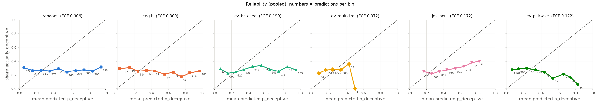

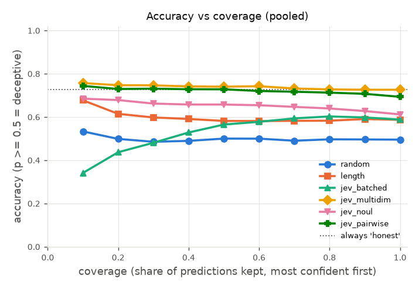

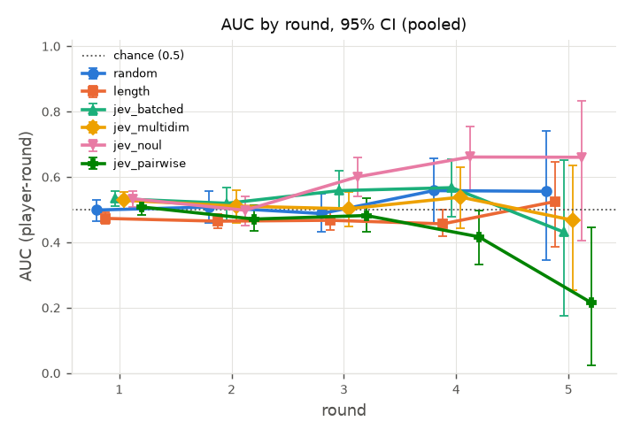

